<h1 align="center">Novara</h1>

<strong>English</strong> · <a href="README.zh-CN.md">简体中文</a>

  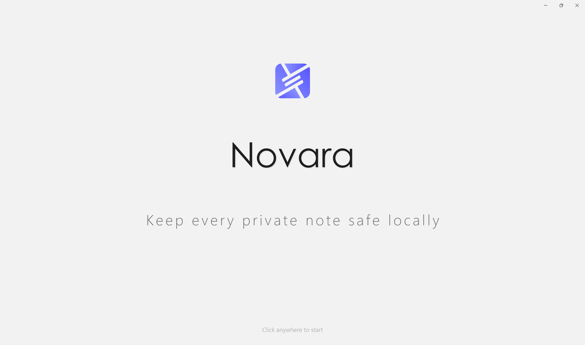

---

Novara is a **local-first, privacy-focused knowledge manager** for Windows, built with C# and WinUI 3. It brings memos, file paths, to-dos, sticky notes, and rich-text records together into a single encrypted database — all stored entirely on your machine with **no cloud uploads, no telemetry, and no account registration**.

Your data lives in `%LocalAppData%\Novara\` as a portable single-file database, optionally protected by **AES-256-GCM authenticated encryption** with a password of up to 64 characters. Whether you are managing daily notes, tracking project tasks, saving frequently used paths, writing a private journal, storing API keys with built-in connectivity testing, or delegating your knowledge base to an AI agent through MCP, Novara keeps everything in one fast, native, reliably offline application.

---

## What's New in 6.2

- **Small-window friendly dialogs** — dialogs across the whole app now adapt to split-screen and short windows: confirm buttons stay visible at the card bottom, long content scrolls instead of being clipped, and open dialogs re-fit live while you resize the window
- **Full-page scrolling note editor** — the note dialog keeps its title and confirm button pinned while the content area scrolls as one page, so long notes stay editable on any window size
- **Predictable pinning** — a pinned memo entry rises to the top of its own group or the ungrouped stack and never escapes it; a pinned group lifts itself with everything inside to the top of the list. Moving entries between groups starts them clean — stars and pins stay behind

## Security & Privacy Lock

Optional password protection backed by **AES-256-GCM authenticated encryption**. Once enabled, your entire database is encrypted at rest — every memo, path, todo, note, and record becomes unreadable without the correct password. Passwords may be **6 to 64 characters** and are never stored in plaintext: only a salted, versioned hash is kept locally (PBKDF2-SHA256 with 3,000,000 iterations since its second revision). There is no backdoor, no recovery mechanism, and no cloud dependency — if you forget your password, the only way forward is to wipe the database and start over.

GCM adds **authenticated encryption**: any tampering with the encrypted file is detected by the cryptographic tag, so corrupted or modified data is reported instead of silently misread. Older databases upgrade in place: the 2.0-era AES-CBC format migrates to GCM after one confirmation, and since 5.3 the key derivation is calibrated at **3,000,000 PBKDF2 iterations** (format v3) via a one-time opt-in prompt.

Security is reinforced by a **30-minute lockout after 5 consecutive failed attempts** — the counter and lock state persist across restarts and use a monotonic clock to resist system-time rollback. Since 5.0, you can also unlock with **Windows Hello** (biometrics / PIN). And since 5.1 the vault can lock itself: on demand (**Ctrl+Shift+L**), after an idle timeout of your choosing, or whenever Windows locks its session. The lock screen follows your system theme, covers the entire window, and clears its input automatically when the window loses focus.

  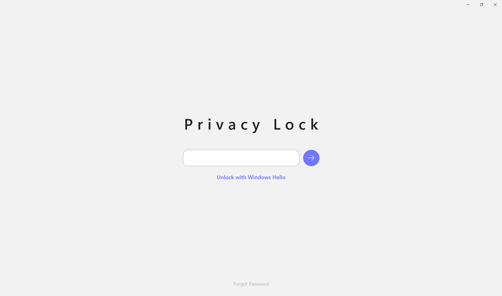
  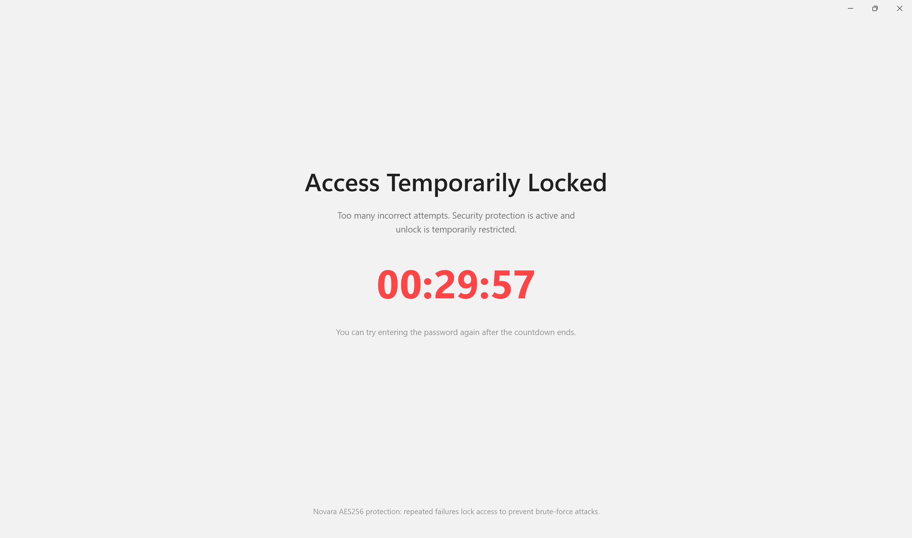

## Memo Manager

The home page where all your memos live — the central hub of Novara. Organize entries into custom groups, star or pin important ones for instant access, and move entries between groups via the context menu.

Eight built-in entry types cover the majority of use cases:

- **Email** — address + password
- **Account** — account name + password
- **API Key** — key + endpoint URL + model ID
- **Website** — name + URL
- **Bank Card** — card details
- **WiFi** — network credentials
- **ID** — identity documents
- **Custom** — unlimited flexible key-value fields

Starred and pinned entries are lifted to the top, and every card displays its key information on the second line so you can identify entries at a glance. Sensitive field rows carry a one-click copy button, and a built-in generator creates random passwords, UUIDs, and tokens right inside the entry dialogs.

Email, account, website, and WiFi entries also accept a **TOTP secret** (paste an `otpauth://` URI or a Base32 key): the card then shows a live 6-digit code with remaining seconds, a countdown bar, and one-click copy — a proper two-factor companion without a phone.

  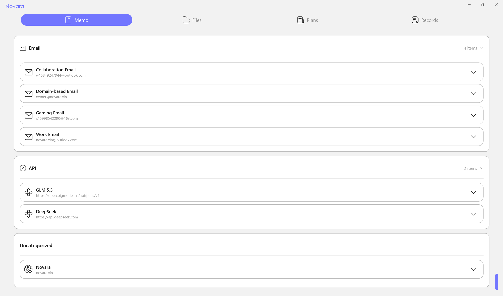

### API Key Management & Detection

Every API Key entry ships with a **three-tier detection** system, run entirely against the endpoint you configured — your key never leaves your machine except to that endpoint:

| Tier | What it does | Token cost |
|------|--------------|-----------|
| **Connectivity test** | Probes `GET /v1/models` to verify the key is valid | 0 |
| **Status diagnosis** | Infers balance presence, reads metadata, measures latency / TTFT | 1–3 |
| **Relay probe** | 8 weighted probes detect model substitution, "watering down", and poisoning | tens–hundreds |

The relay probe is Novara's standout feature for the API-relay era: it sends randomized, nonce-tagged test prompts and cross-checks **identity**, **capability benchmarks**, **format compliance**, **token billing**, **tool calling**, **hidden injection**, **response poisoning**, and **long-context truncation**, then produces a weighted risk verdict (trusted / mostly trusted / suspected risk / high risk). Probe data lives in a local, updatable `ProbeDataSet.json`, and all results carry a fixed disclaimer — this is a probabilistic self-check, not a legal proof.

  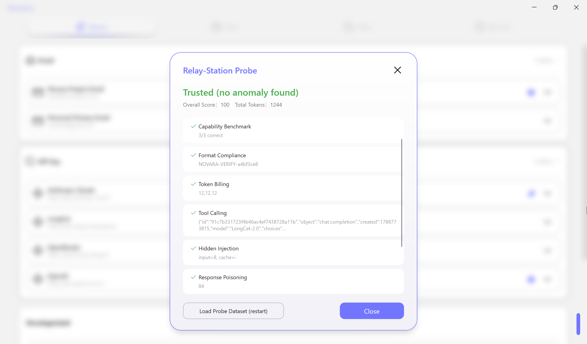

## File Path Manager

Save and organize file and folder paths you access frequently. One click copies the path, another opens it in Explorer with the file or folder highlighted. When creating or editing an entry, type the path or pick it with the built-in file/folder pickers.

Novara continuously validates every saved path with instant visual feedback: a **green border** means the path exists, a **red border** means it is missing or inaccessible. Checks run on create/edit, on a 30-minute timer, on startup, on a full scan from the empty area, or via right-click on an individual card.

  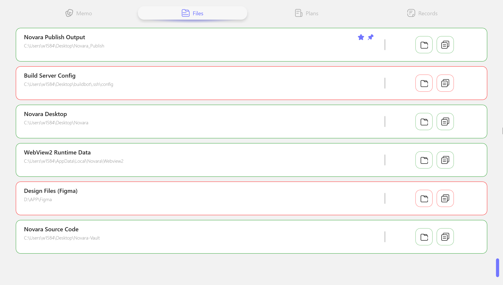

## Task Dashboard

A lightweight productivity board that combines to-do lists, sticky notes, and timed reminders.

- **Todo cards** — main task + optional subtasks with smart linkage: all subtasks checked auto-completes the main task; unchecking any subtask reopens it. States persist across restarts.
- **Sticky notes** — quick unstructured notes; long content or line breaks show an expand button.
- **System reminders** — right-click the empty board to add a countdown card that rings, pulses, and closes automatically, even when Novara is not running.

  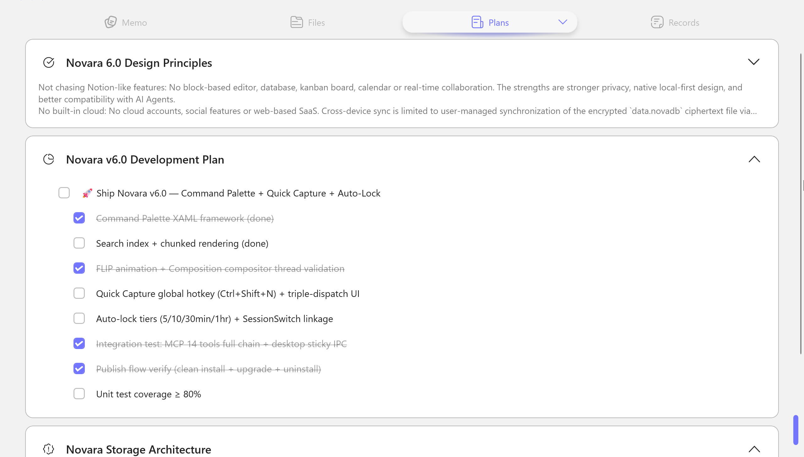

## Desktop Sticky Notes

Send any note or todo card to your desktop with one click. A dedicated lightweight host process (**StickNoteHost**) keeps notes visible even when the main app is closed:

- **Drag & resize** — unlock a note to move it and resize it from any edge
- **Lock & pin** — fix position, stay on top, survive Win+D
- **Theme & language sync** — notes follow the app's theme and language instantly
- **Edit on desktop** — right-click a note and Novara opens its editor automatically
- **Bidirectional todo sync** — checking a todo on the desktop writes back to the main app, which stays the single source of truth

  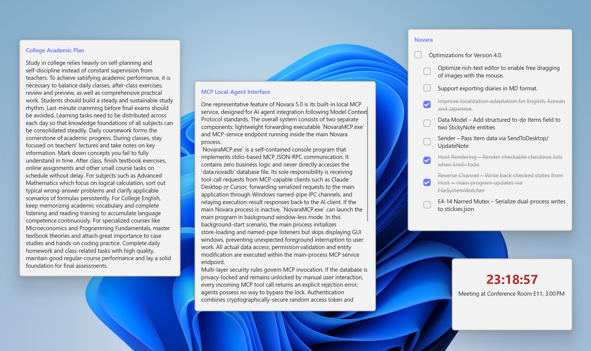

## Records

A full-featured long-form platform that hosts two formats in one page:

- **HTML diary** — a rich-text editor (WebView2 + Tiptap) with bold, italic, underline, colors, images, and links; floating capsule toolbar, image drag-resize, auto-save, and double HTML sanitization against XSS
- **Markdown document** — a source / preview split editor (WebView2 + markdown-it) with real-time preview, ideal for project notes, meeting minutes, and knowledge-base pages
- **Import Markdown** — pull in existing `.md` files so both you and an AI agent can read and edit them

A filter bar (mixed / diary / documents) and per-card format badges keep everything organized. Titles are rendered as plain text and limited to 120 characters.

  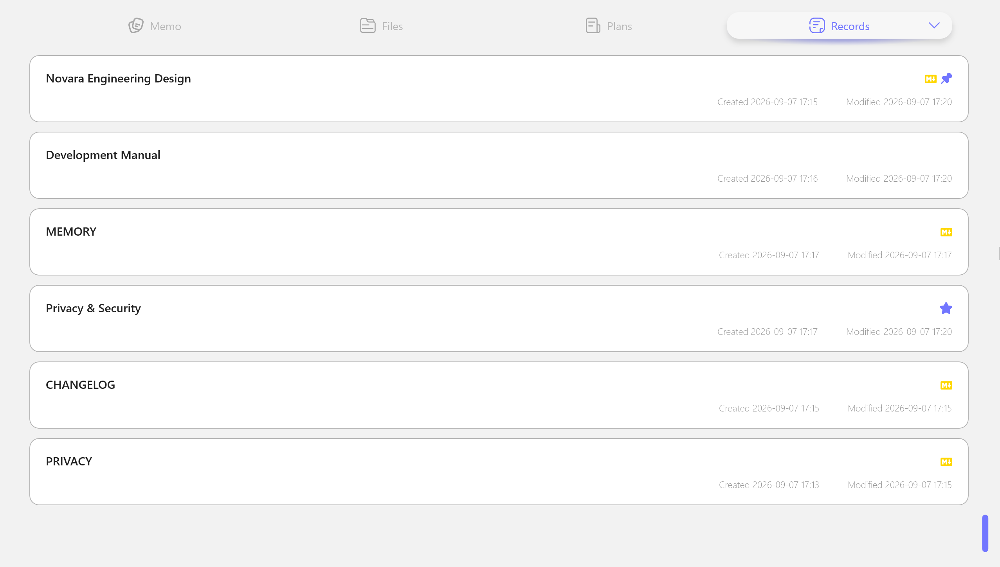

  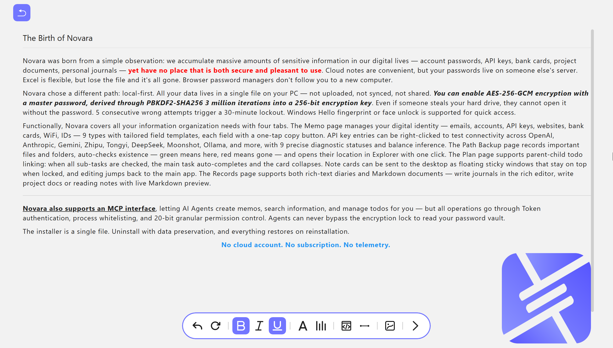
  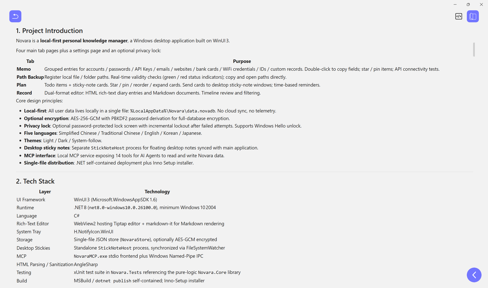

## Workspaces

Sometimes one flat list isn't enough, but folders are overkill. A **workspace** is a virtual filter that spans memos, paths, todos, notes, and records at once: create a space for a project, assign cards to it, and switching spaces reshapes every list. Cards never move between "folders" — the database stays flat — so a card can belong to your workflow without being locked into it.

## Global Search

Press **Ctrl+K** anywhere to search memos, paths, todos, notes, and records in one aggregated list. Search is **indexed** for speed and supports **fuzzy matching** (subsequence matching, e.g. "memo" hits "memorandum"), with title hits ranked first. Click a result to jump straight to the item — Novara navigates, scrolls the target into view, and pulses it with a brand-colored flash.

Ctrl+K doubles as a **command palette**: type `>` and the same box runs commands — create a memo / todo / note / diary, open the recycle bin or settings, lock the vault now.

  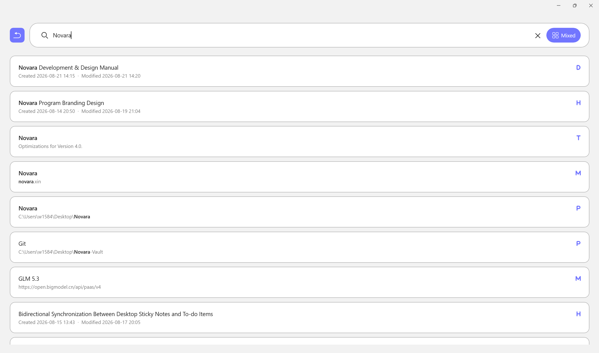

## Recycle Bin

Deleted cards are never lost instantly — they move to a **Recycle Bin** with a **7-day auto-purge**, recoverable for a week before permanent removal on the next startup. Supports restore, permanent delete (red double-confirmation), clear all, and a mixed chronological list. Recycled data is excluded from exports.

  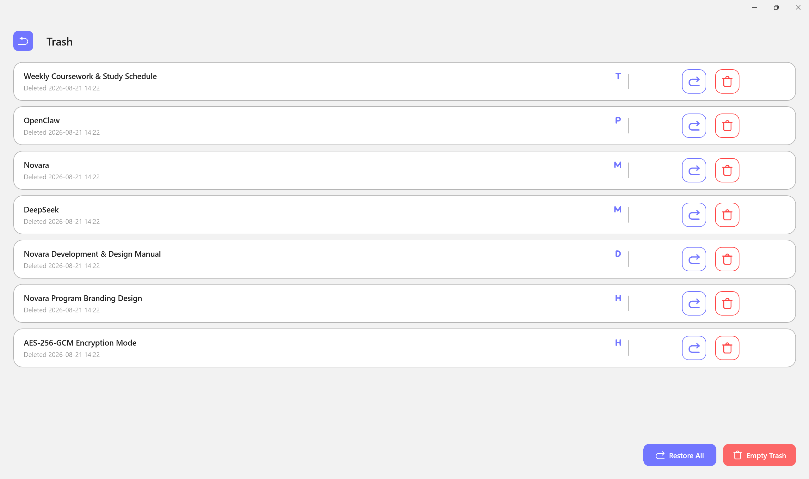

## MCP Agent Interface

Novara exposes a native **MCP server** (Model Context Protocol) so any AI agent — Claude, coding assistants, or custom agents — can work with your knowledge base as a first-class client. It ships as a separate **`NovaraMCP.exe`** that speaks stdio JSON-RPC 2.0 and forwards every call to the running Novara app (the single data authority).

**14 tools** across five data types (`memo` / `todo` / `note` / `diary` / `path`):

- `create_memo` · `create_todo` · `create_note` · `create_diary` · `create_path`
- `update_memo` · `update_todo` · `update_note` · `update_diary` · `update_path`
- `delete_item` · `list_items` · `read_item` · `search_items`

**Security model** (enabled in Settings → MCP card):

- **Off by default** — you opt in, then copy a token
- **Token auth** — fixed-time comparison; passed via `NOVARA_MCP_TOKEN` or `--token`
- **Unlock gate** — the database must be unlocked; a locked/encrypted store refuses every request
- **Per-client approval & permissions** — the first connection from any process requires your explicit approval, and each approved client gets its own read / create / update / delete matrix across the five data types. New clients start read-only everywhere except memos — the credential vault is the last thing an agent should touch, so it is the first thing that's held back
- **Deletion master switch** — deleting requires both the client's own permission bit and a global toggle
- **Audit log** — every call (allowed, redacted, or denied) is recorded locally. You always know what your AI has accessed
- **Sensitive-field redaction** — password/key/token fields read back as `****`, are excluded from search, and cannot be smuggled out by renaming their labels

See [`docs/MCP.md`](docs/MCP.md) for the full tool reference and client configuration.

## Five-Language UI

Novara ships with **five complete interface languages** — 简体中文, 繁體中文, English, 한국어, and 日本語 — plus a **Follow System** option. Switching restarts the app fully translated; your data stays language-independent.

## Theme System

Light, Dark, and Follow System themes with a unified brand-button system (primary blue / ghost outline / destructive red) consistent across every dialog.

  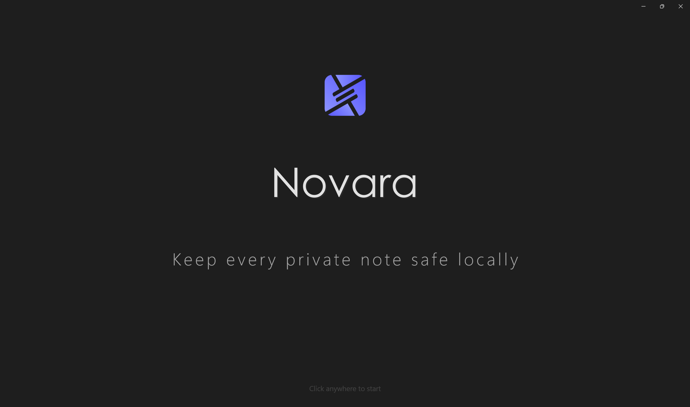

## Data Import & Export

Your data moves with you, freely and without vendor lock-in:

- **Encrypted backups** — export an authenticated `.novaenc` container protected by a separate backup password; plaintext exports warn when your vault is encrypted
- **Native backup** — plaintext `.novabak` export with a SHA-256 integrity header (older MD5-headered files still import); path entries excluded by default for new-machine migration
- **CSV import/export** — auto-detects Novara, KeePass, Bitwarden, and the Firefox / Chrome / 1Password / Proton Pass dialects for migrating credentials
- **PDF / HTML collection** — export all records as a printable HTML or PDF collection
- **Markdown export** — per-entry Markdown, with or without images
- **Rolling auto-backup** — up to 10 local snapshots you can restore from

## Startup, Tray & System Integration

- **Auto-start with Windows** — your workspace is ready when you log in
- **System tray mode** — keep Novara running silently in the background
- **Quick Capture** — Ctrl+Shift+N from anywhere: a small overlay takes the text and dispatches it to a memo, todo, or note
- **Global right-click menu** — add any folder/file to path backups from Explorer, or open Novara from the desktop
- **Desktop reminders** — countdown cards keep working even when the app is closed

## Data & Privacy at a Glance

- **Local-first**: everything stays on your machine — no cloud, no telemetry, no account
- **Authenticated encryption**: AES-256-GCM with PBKDF2 key derivation (3,000,000 iterations since format v3)
- **Portable single file**: `data.novadb` holds all seven partitions; optional password protects the whole database
- **Health check**: encryption status, latest backup, snapshot count, file integrity, and orphan references at a glance
- **Recoverable deletes**: the recycle bin gives you a week before anything is truly gone
- **Agent-ready without data leaks**: the MCP interface never sends your data anywhere by itself

## Privacy & Security

- **Privacy Policy** — [English](PRIVACY.md) · [简体中文](PRIVACY.zh-CN.md)
- **Security Policy** — [English](SECURITY.md) · [简体中文](SECURITY.zh-CN.md)

## License

Novara is released under the [MIT License](LICENSE.md).

---

Novara is free to use and designed to stay that way. For the latest releases and the official guide, visit **novara.xin**.
