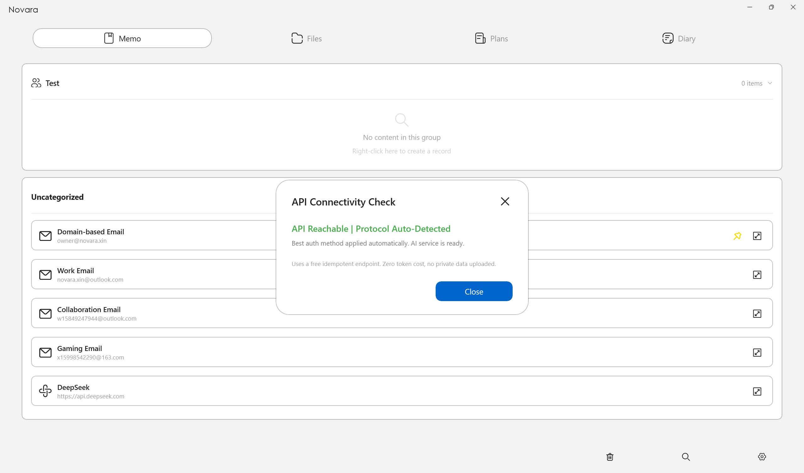

# Novara
Novara is a local-first, privacy-focused memo application built with C# and WinUI 3 for Windows. It consolidates memos, file paths, to-do lists, sticky notes, and a rich-text diary into a single encrypted database — all stored entirely on your local machine with no cloud uploads, no telemetry, and no account registration. Your data lives in %LocalAppData%\Novara\ as a portable single-file database, optionally protected by AES256-GCM encryption with a 6-digit PIN. Whether you are managing daily notes, tracking project tasks, saving frequently used file paths, writing a private diary, or storing API keys with built-in connectivity testing, Novara brings everything together in one native Windows app that feels fast, responsive, and reliably offline. With deep system integration, dark/light theme support, bilingual interface (English/Chinese), and a strong commitment to long-term stability — backed by a comprehensive development specification document that tracks over 60 UI state rules and 70+ bug fixes — Novara is designed to be the last note-taking tool you will ever need.

  

## Privacy Lock
Optional 6-digit PIN protection powered by AES256-GCM encryption. Once enabled, all database content is encrypted at rest. The PIN is never stored in plaintext — only a salted SHA256 hash is kept locally. There is no backdoor, no recovery mechanism, and no cloud dependency. If you forget your PIN, the only option is to wipe the entire database and start fresh.
Auto-locks after 5 consecutive failed attempts (30-minute lockout, persists across app restarts)
Password change requires verification of the current PIN
Lock screen follows system theme and covers the entire window
Input field clears automatically when the window loses focus (shoulder-surfing protection)

  

## Memo Manager
The home page where all your memos live. Organize entries into custom groups, star or pin important ones for quick access, and search across everything instantly. Each entry supports a title, content, tags, and optional remarks — flexible enough for passwords, account notes, code snippets, or any other text-based information you need to keep close.

Group-based organization with drag-to-move support
Star and pin priority system for quick access
Full-text search across all entries with real-time filtering
Entry types: Email, Account, API Key, or Custom

  

### API Key Management & Connectivity Testing
As AI agents and LLM-powered applications become essential tools in daily workflows, managing API keys securely has never been more important. Novara provides a dedicated API Key entry type that stores your keys in an encrypted database — keeping them safe from plaintext leaks, screenshot accidents, or prying eyes.

But storage is only half the story. An invalid or expired API key can break your workflows at the worst possible moment. That is why every API Key entry comes with a built-in connectivity test: right-click any API Key entry, select "Test Connectivity," and Novara automatically probes the endpoint with a GET /v1/models request (idempotent, no cost incurred). It intelligently tries Bearer token authentication first, and if the server responds with 401 or 403, it retries without Bearer — ensuring compatibility with both OpenAI-standard and domestic Chinese providers.

Five test states: Testing (theme color) / Success (green) / Auth Failed (red) / No Models Endpoint (yellow) / Network Error (red)
Advanced configuration available only after a failed test — choose between OpenAI Standard (Bearer), Domestic Compatible (No Bearer), or RAW (testing disabled)
Successful tests automatically save the working protocol; failed tests never alter your saved configuration
Every API Key card displays its endpoint URL on the second line for quick identification

  

## File Path Manager
A dedicated page for saving and organizing file and folder paths that you frequently access. Instead of digging through Explorer every time, store your important locations here — project directories, configuration files, log folders, or any other path you need to reach quickly.
Each path card displays the name, full path, and optional remarks in a clean three-line layout. One click copies the path to your clipboard, another opens the location in Explorer with the file or folder automatically highlighted.

### Real-Time Path Validity Detection
Paths change. Files get moved, renamed, or deleted. A saved path is only useful if it still points to something that actually exists. Novara continuously monitors every saved path and gives you instant visual feedback:
Green border — the path exists and is accessible
Red border — the file or folder is missing, moved, or inaccessible

Validity checks run automatically in five scenarios: when you create or edit a path entry, on a 30-minute background timer, during app startup, when you trigger a full scan from the empty area, or via right-click on an individual card. This means you will always know — at a glance — whether your saved locations are still valid, so you never waste time clicking into a dead path.

  

## Task Dashboard
A lightweight productivity board that combines to-do lists and sticky notes in one place. Use it for project planning, daily task tracking, or simply jotting down quick thoughts that do not deserve a full memo entry.

### Todo Cards
Each todo card consists of a main task and optional subtasks. Subtasks are displayed inline beneath the main item, and the card can be collapsed or expanded with a single click.
Subtasks all checked → main task automatically checked → card collapses to save space
Uncheck any subtask → main task unchecks automatically → card expands to show everything
Manually uncheck the main task → subtasks remain unchanged, card expands
No subtasks → expand/collapse button is hidden; checking the main task marks the card complete and collapses it

### Sticky Notes
For quick, unstructured notes that do not fit into a todo format. Each note can hold longer text content.
Content exceeds 240 characters or contains line breaks → an expand button appears
Expanded view removes MaxLines restriction to show the full content
Expand/collapse state is persisted across app restarts

### Persistent State & Priority
All checked states are saved to disk and survive app restarts. Star and pin priority work the same as other pages — starred or pinned cards appear at the top, with golden badges clearly marking their status.

  

## Rich Text Diary
A full-featured rich-text diary editor built on WebView2 that turns journaling into a polished writing experience. Whether you are keeping a personal journal, drafting meeting notes, or writing detailed project documentation, the editor provides the tools you need to express yourself clearly.

  

### Rich-Text Editing Tools
The toolbar floats as a compact capsule above your content, staying accessible without scrolling back to the top. All formatting options are applied instantly with visual feedback:
Bold, Italic, Underline — toggle styles with one click or keyboard shortcuts; selected state syncs with cursor position
Font Color — choose any color to highlight or differentiate text
Image Insertion — paste or upload images directly into the editor; base64-encoded and stored within the database
HTML Import — paste formatted content from other sources; automatically sanitized to remove scripts and dangerous attributes

### Auto-Save & Data Safety
The editor automatically preserves your content when you navigate away or close the app. Title and body are saved independently, and the system prevents blank overwrites — if the editor is not ready or content fails to load, saving is blocked to protect existing data. All HTML content is double-sanitized on save and load with a strict whitelist (b, strong, i, em, u, span, font, div, br, p, img, ul, ol, li), stripping any script tags, event handlers, and dangerous protocols to keep your diary safe from XSS.

  

## Dual-Language UI
Novara ships with full English and Chinese interface support, with more languages planned for future releases. Switching languages is instantaneous — select your preferred language from the Settings page, confirm the change, and the app restarts with the new language applied across every page, dialog, and menu.
English and Chinese (zh-CN) fully supported
Static resource dictionary architecture — no runtime XAML merging, zero crash risk
Fallback chain: stored preference → system language → Chinese (default)
All user data remains language-independent; only UI text is translated

  

## Theme System
Novara offers three theme options — Light, Dark, and Follow System — with seamless switching from the Settings page. Every color, border, and surface has been carefully tuned across multiple rounds of refinement to ensure a polished, premium look in both modes. Dark mode is rich and comfortable for late-night use; Light mode is crisp and clean for daytime productivity. The theme applies globally across all pages, dialogs, and menus, and persists across app restarts.
Light, Dark, and Follow System modes
Carefully calibrated color palettes with balanced contrast
Consistent accent colors, hover states, and surface elevations
Theme persistence across app restarts

  

## Data Import & Export
Your data should move with you — freely, securely, and without friction. Novara provides full database backup and restore capabilities, ensuring your memos, todos, diary entries, and settings are never locked into a single machine.
Exports are always generated in plaintext with a complete MD5 integrity header, making them human-readable, easily inspectable, and compatible across versions. Whether you are migrating to a new device, reinstalling Windows, or simply keeping an offline archive, the export process preserves every piece of your data with zero loss.
Imports are handled with equal care. The system performs thorough validation before merging — duplicate IDs are automatically regenerated, null partitions are normalized, and orphaned references are cleaned up. If the import process fails at any point, the database is safely rolled back to its previous state, ensuring your data is never left in a half-imported, corrupted condition.
For encrypted databases, both import and export require password verification, ensuring your data stays protected even during transfer. The result is a backup system that is both powerful and transparent — your data, always within your control, always ready to move with you.

## Startup & Tray Options
Novara adapts to the way you work. Enable automatic startup with Windows so your notes are always ready when you log in. For users who prefer quick access without cluttering the taskbar, the system tray mode keeps Novara running silently in the background — click the tray icon to show or hide the main window, or right-click for quick actions.
Optional auto-start with Windows (registry-based, reliable detection)
Tray mode: minimize to system tray instead of closing
Click tray icon to restore window; right-click for exit and show options
Both settings persist across app restarts

## Tech Stack
- Language: C# / XAML
- UI Framework: WinUI 3 / Windows App SDK 1.6
- Runtime: .NET 8 LTS
- Target OS: Windows 10 (Build 19041, 2004) & Windows 11
- Deployment: Self-contained publish + Inno Setup installer
- Storage: Single-file JSON database with optional AES256-GZip encryption
- Rich Text Engine: WebView2 (Edge Chromium)

## Installation
Download the latest installer from the Releases page, then follow these steps:
- Run Novara-Setup.exe
- Follow the setup wizard to complete installation
- Launch Novara from the desktop shortcut or Start Menu

### System Requirements
- Windows 10 Version 2004 (Build 19041) or newer / Windows 11
- WebView2 Runtime (will auto-install if missing)
- .NET 8 Runtime (bundled inside self-contained package)

## Local Data Directory
All user data is stored in this local path:%LocalAppData%\Novara\
File breakdown:
- `data.novadb`: Main JSON database (plaintext or AES encrypted)
- `security.dat`: Password salt & SHA256 hash storage
- `lockout.dat`: Password failure counter & lock timer
- `language.dat`: Saved UI language preference

You can migrate all your notes by copying this entire folder to another PC.

## Security Specifications
- Local-only AES256-GCM encryption, PBKDF2 key derivation with 100,000 iterations
- Passwords are stored as salted SHA256 hashes; plaintext passwords are never saved on disk
- Database protected by exclusive file lock + Hidden / Read-only file attributes
- Diary HTML content double-sanitized on save & load, strips `<script>`, inline event attributes and malicious protocols like `javascript:`
- No outbound network requests except manual API connectivity tests initiated by users

## Core Architecture Highlights
- Single-file database with 7 isolated logical partitions: Diaries, File Paths, To-Dos, Stickies, Memo Groups, Memo Entries, App Settings
- Memory-first design: Full data load on startup; all edits are written to disk via thread-safe async operations
- Atomic write mechanism using temporary `.tmp` files to prevent database corruption on crash
- Unified theme rendering via `App.GetBrush()` to maintain consistent colors across all UI elements
- Double HTML sanitization for diaries to block XSS injection vectors

### Contact Us
For business inquiries, technical support, bug reports, feature suggestions, or any other feedback, please reach out to us
- owner@novara.xin
- novara.xin@outlook.com
- Novara_xin@163.com

We read every message and appreciate your input.
