<h1 align="center">Novara</h1>

<strong>English</strong> · <a href="README.zh-CN.md">简体中文</a>

  
  
  
  
  

  
  
  
  
  

  
  
  
  
  

  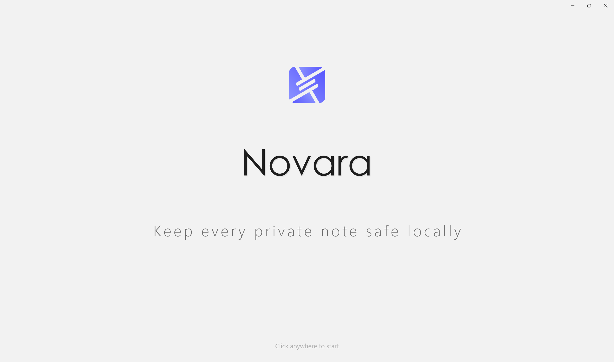

---

Novara is a **local-first personal data control layer — for you, and for your AI agents**, built with C# and WinUI 3. Your data lives on your machine in a single encrypted database — **no cloud uploads, no telemetry, no account registration**. Your AI agents can use it through a permission-checked interface, and since 7.0 your data can travel with you: encrypted snapshots you can read anywhere. Since 8.0 it also **synchronizes across your own devices** through a server you host yourself — no account, no official cloud, and the server still only ever handles ciphertext: the plaintext never leaves your control.

Not a password manager. Not a notes app. A data control layer for the AI era — **both you and your AI can use the data, but only you hold the keys.**

Today that layer takes the shape of memos (with built-in API-key connectivity testing), file paths, to-dos, sticky notes, and rich-text records, in one fast, native application that works fully offline. Your data lives in `%LocalAppData%\Novara\` as a portable single-file database, optionally protected by **AES-256-GCM authenticated encryption** with a password of up to 64 characters.

---

## 10.0 — Built to Be Verified

10.0 is the trust release: most of the work went into making Novara verifiable from the outside. Releases are signed with Sigstore and can be checked with `cosign`; the build is pinned and reproducible on the input side; and the security posture is published rather than asserted. A bilingual threat model states what Novara protects against and what it does not, and a code signing policy documents who authors, reviews and approves release binaries. Every push is gated on locked dependency restores, vulnerability and licence audits, and an 80% line-coverage floor, while the packaging job refuses to ship unless two independent publishes come out byte-identical. On the desktop, the record editor gains a live split preview that follows the line you are typing.

Full details: [Release v10.0.0](https://github.com/Novara-owner/Novara-Vault/releases/tag/v10.0.0) · [CHANGELOG](CHANGELOG.md)

## 9.0 — Self-Hosting, One Command Away

9.0 is the deployment release: the server you could already run on Windows now ships the way servers actually reach people. One `docker compose up -d` brings up the sync server with automatic HTTPS on hardware you already own — an official container image, an operations CLI, a 36-page help center and per-release verification assets included. Nothing about the data changes — the server still only ever handles ciphertext, and the red lines did not move. On the desktop, 9.0 adds export-as-image, four paper themes, an animation toggle, an in-app update checker and a rebuilt sticky-note card.

Full details: [Release v9.0.0](https://github.com/Novara-owner/Novara-Vault/releases/tag/v9.0.0) · [CHANGELOG](CHANGELOG.md)

## Security & Privacy Lock

Optional password protection backed by **AES-256-GCM authenticated encryption**. Once enabled, your entire database is encrypted at rest — every memo, path, todo, note, and record becomes unreadable without the correct password. Passwords may be **6 to 64 characters** and are never stored in plaintext: only a salted, versioned hash is kept locally (PBKDF2-SHA256 with 3,000,000 iterations since its second revision). There is no backdoor, no recovery mechanism, and no cloud dependency — if you forget your password, the only way forward is to wipe the database and start over.

GCM adds **authenticated encryption**: any tampering with the encrypted file is detected by the cryptographic tag, so corrupted or modified data is reported instead of silently misread. Older databases upgrade in place: the 2.0-era AES-CBC format migrates to GCM after one confirmation, and since 5.3 the key derivation is calibrated at **3,000,000 PBKDF2 iterations** (format v3) via a one-time opt-in prompt.

Security is reinforced by a **30-minute lockout after 5 consecutive failed attempts** — the counter and lock state persist across restarts and use a monotonic clock to resist system-time rollback. Since 5.0, you can also unlock with **Windows Hello** (biometrics / PIN). And since 5.1 the vault can lock itself: on demand (**Ctrl+Shift+L**), after an idle timeout of your choosing, or whenever Windows locks its session. The lock screen follows your system theme, covers the entire window, and clears its input automatically when the window loses focus.

  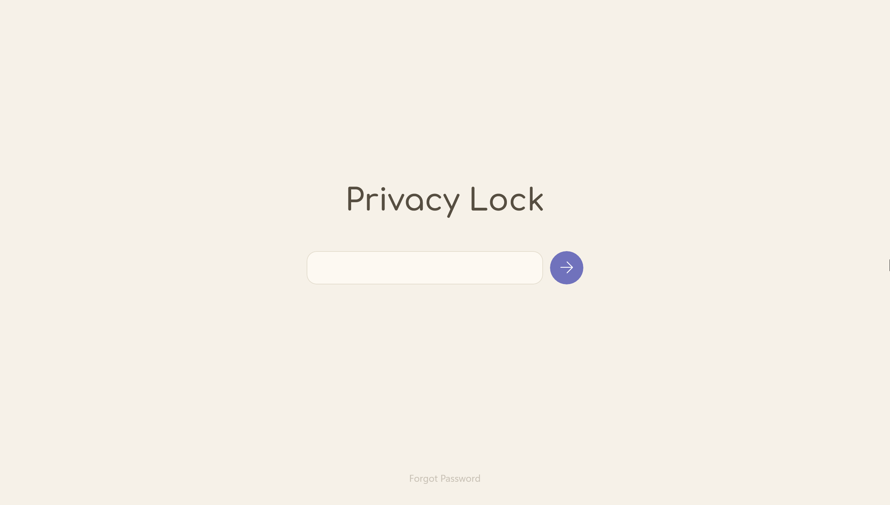

## Memo Manager

The home page where all your memos live — the central hub of Novara. Organize entries into custom groups, star or pin important ones for instant access, and move entries between groups via the context menu.

Eight built-in entry types cover the majority of use cases:

- **Email** — address + password
- **Account** — account name + password
- **API Key** — key + endpoint URL + model ID
- **Website** — name + URL
- **Bank Card** — card details
- **WiFi** — network credentials
- **ID** — identity documents
- **Custom** — unlimited flexible key-value fields

Starred and pinned entries are lifted to the top, and every card displays its key information on the second line so you can identify entries at a glance. Sensitive field rows carry a one-click copy button, and a built-in generator creates random passwords, UUIDs, and tokens right inside the entry dialogs.

Email, account, website, and WiFi entries also accept a **TOTP secret** (paste an `otpauth://` URI or a Base32 key): the card then shows a live 6-digit code with remaining seconds, a countdown bar, and one-click copy — a proper two-factor companion without a phone.

  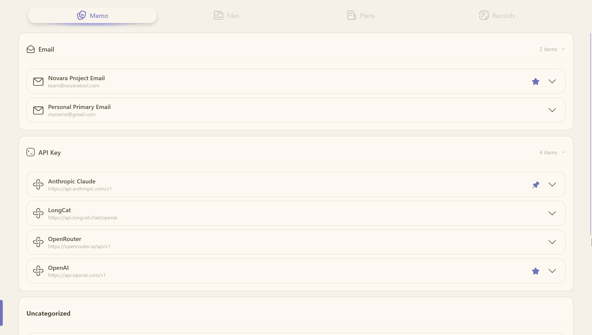

### API Key Management & Detection

Every API Key entry ships with a **three-tier detection** system, run entirely against the endpoint you configured — your key never leaves your machine except to that endpoint:

| Tier | What it does | Token cost |
|------|--------------|-----------|
| **Connectivity test** | Probes `GET /v1/models` to verify the key is valid | 0 |
| **Status diagnosis** | Infers balance presence, reads metadata, measures latency / TTFT | 1–3 |
| **Relay probe** | 8 weighted probes detect model substitution, "watering down", and poisoning | tens–hundreds |

The relay probe is Novara's standout feature for the API-relay era: it sends randomized, nonce-tagged test prompts and cross-checks **identity**, **capability benchmarks**, **format compliance**, **token billing**, **tool calling**, **hidden injection**, **response poisoning**, and **long-context truncation**, then produces a weighted risk verdict (trusted / mostly trusted / suspected risk / high risk). Probe data lives in a local, updatable `ProbeDataSet.json`, and all results carry a fixed disclaimer — this is a probabilistic self-check, not a legal proof.

  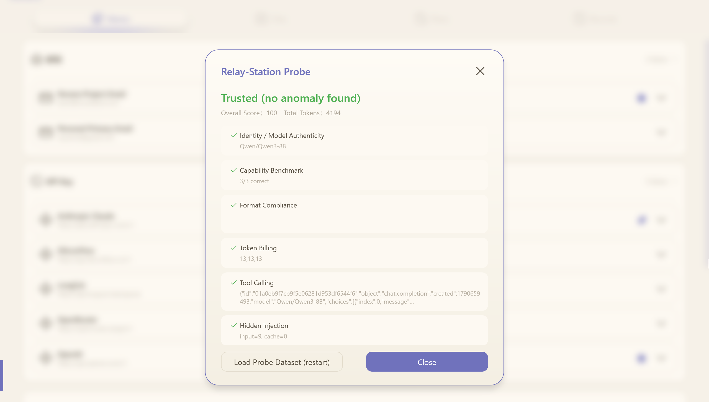

## File Path Manager

Save and organize file and folder paths you access frequently. One click copies the path, another opens it in Explorer with the file or folder highlighted. When creating or editing an entry, type the path or pick it with the built-in file/folder pickers.

Novara continuously validates every saved path with instant visual feedback: a **green border** means the path exists, a **red border** means it is missing or inaccessible. Checks run on create/edit, on a 30-minute timer, on startup, on a full scan from the empty area, or via right-click on an individual card.

  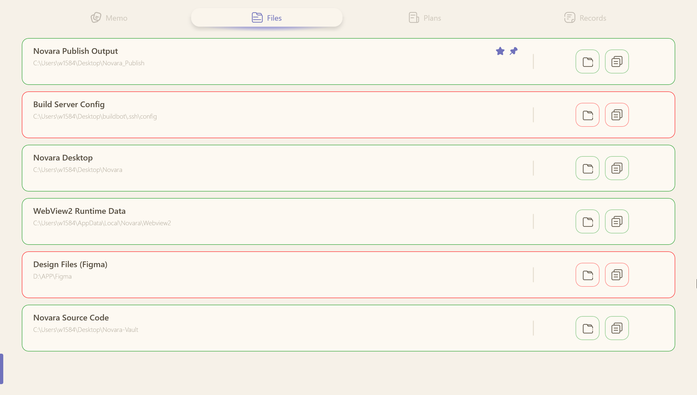

## Task Dashboard

A lightweight productivity board that combines to-do lists, sticky notes, and timed reminders.

- **Todo cards** — main task + optional subtasks with smart linkage: all subtasks checked auto-completes the main task; unchecking any subtask reopens it. States persist across restarts.
- **Sticky notes** — quick unstructured notes; long content or line breaks show an expand button.
- **System reminders** — right-click the empty board to add a countdown card that rings, pulses, and closes automatically, even when Novara is not running.

  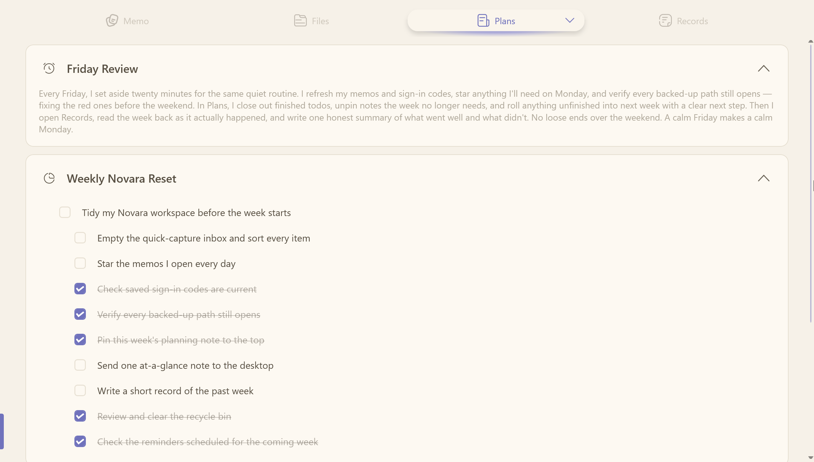

## Desktop Sticky Notes

Send any note or todo card to your desktop with one click. A dedicated lightweight host process (**StickNoteHost**) keeps notes visible even when the main app is closed:

- **Drag & resize** — unlock a note to move it and resize it from any edge
- **Lock & pin** — fix position, stay on top, survive Win+D
- **Color palette** — a self-contained 24-color palette with per-note color and size persistence, and context menus that follow the main app
- **Theme & language sync** — notes follow the app's theme and language instantly
- **Edit on desktop** — right-click a note and Novara opens its editor automatically
- **Bidirectional todo sync** — checking a todo on the desktop writes back to the main app, which stays the single source of truth

  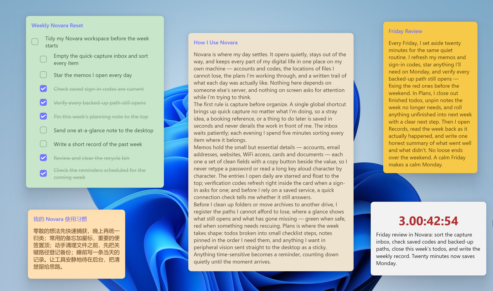

## Records

A full-featured long-form platform that hosts two formats in one page:

- **HTML diary** — a rich-text editor (WebView2 + Tiptap) with bold, italic, underline, colors, images, and links; floating capsule toolbar, image drag-resize, auto-save, and double HTML sanitization against XSS
- **Markdown document** — a source / preview split editor (WebView2 + markdown-it) with real-time preview, ideal for project notes, meeting minutes, and knowledge-base pages
- **Import Markdown** — pull in existing `.md` files so both you and an AI agent can read and edit them

A filter bar (mixed / diary / documents) and per-card format badges keep everything organized. Titles are rendered as plain text and limited to 120 characters.

  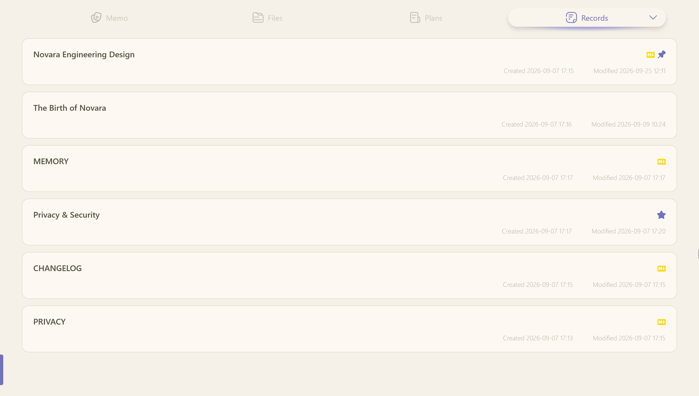

  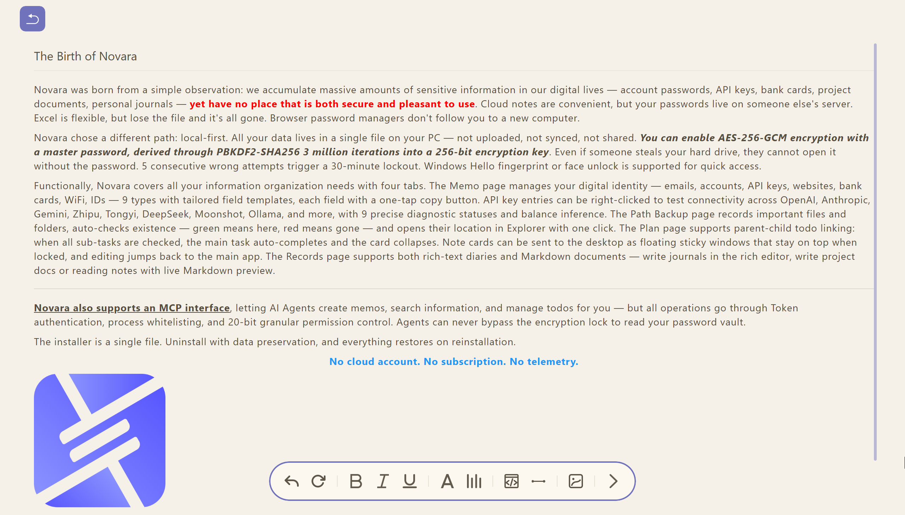
  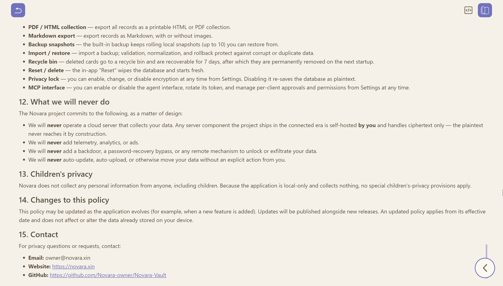
  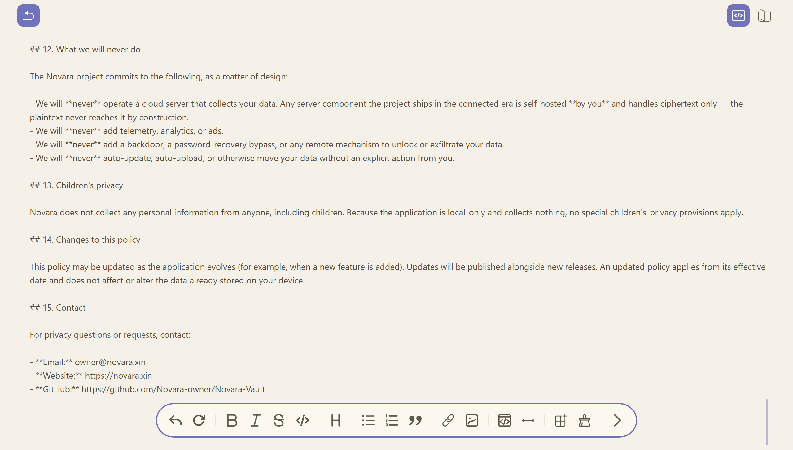

## Novara Snapshot

The first step of the connected era. Export your entire database — memos, paths, todos, notes, records, your choice — as **one self-contained encrypted HTML file**, and read it anywhere:

- **Open anywhere** — double-click the file, or host it on your own NAS / server / any static hosting; the viewer, the decryption, and the data all live inside that one file
- **End-to-end encryption** — the same `.novaenc` AES-256-GCM container as encrypted backups (PBKDF2-SHA256, 3,000,000 iterations); every export requires a password and produces the same encrypted container, whether or not your local vault is encrypted
- **Your password, your only key** — the password is never stored, never sent, and cannot be recovered; a locked snapshot is just noise to anyone holding the file
- **Read-only by design** — masked fields with tap-to-reveal, one-tap copy, and live TOTP codes computed locally in the browser; nothing edits, nothing uploads, nothing persists (refresh and the plaintext is gone from memory)
- **Data-as-of, honestly** — the viewer shows exactly when the snapshot was taken; update by re-exporting

Host it for yourself, or send the file to someone you trust — file and password travel separately.

  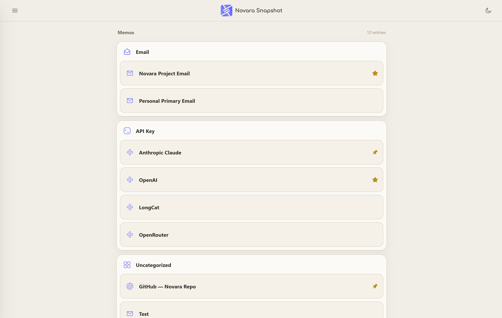

  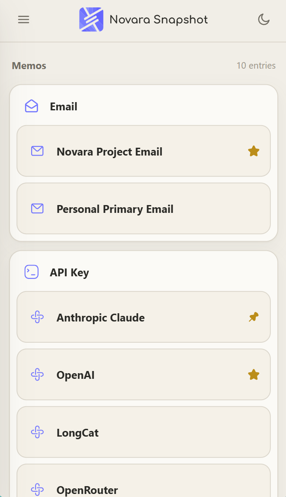
  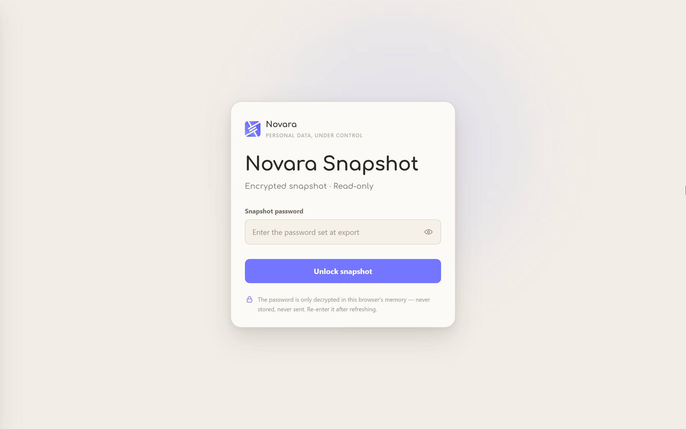

## Cross-Device Sync

Sync keeps one encrypted state converging across your devices — and it is built so the server can never read it.

- **Your server, your rules** — run `NovaraSync` on your own PC, NAS or VPS; it stores versioned ciphertext with a space / device / version index, and holds no key, no user accounts and no telemetry
- **Pairing** — the server prints a space id and an enrollment secret exactly once; you enter those plus its URL on each device. The space key is generated on the first device and never reaches the server
- **The PC stays the authority** — your local database is always the source of truth; wipe the server and one push from your PC restores it
- **HTTPS by design** — the browser side needs a secure context, so the deployment guide recommends a TLS-terminating reverse proxy (Caddy, with automatic certificates) or a private network link
- **Conflicts, stated honestly** — when two devices change the same version the later write wins, and the earlier version is kept as a conflict copy so nothing disappears silently
- **Devices and history** — the device center lists paired devices with trust state and last sync, revokes a device or resets its token, and every sync event lands in a local audit log
- **Offline never degrades** — sync is an enhancement, not a dependency

## Workspaces

Sometimes one flat list isn't enough, but folders are overkill. A **workspace** is a virtual filter that spans memos, paths, todos, notes, and records at once: create a space for a project, assign cards to it, and switching spaces reshapes every list. Cards never move between "folders" — the database stays flat — so a card can belong to your workflow without being locked into it.

## Global Search

Press **Ctrl+K** anywhere to search memos, paths, todos, notes, and records in one aggregated list. Search is **indexed** for speed and supports **fuzzy matching** (subsequence matching, e.g. "memo" hits "memorandum"), with title hits ranked first. Click a result to jump straight to the item — Novara navigates, scrolls the target into view, and pulses it with a brand-colored flash.

Ctrl+K doubles as a **command palette**: type `>` and the same box runs commands — create a memo / todo / note / diary, open the recycle bin or settings, lock the vault now.

  
  

## Recycle Bin

Deleted cards are never lost instantly — they move to a **Recycle Bin** with a **7-day auto-purge**, recoverable for a week before permanent removal on the next startup. Supports restore, permanent delete (red double-confirmation), clear all, and a mixed chronological list. Recycled data is excluded from exports.

  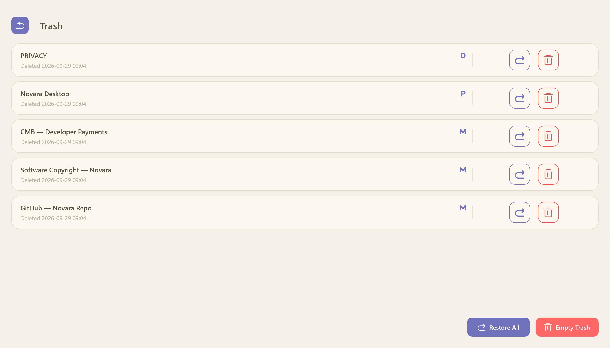

## MCP Agent Interface

Novara exposes a native **MCP server** (Model Context Protocol) so any AI agent — Claude, coding assistants, or custom agents — can work with your knowledge base as a first-class client. It ships as a separate **`NovaraMCP.exe`** that speaks stdio JSON-RPC 2.0 and forwards every call to the running Novara app (the single data authority).

**14 tools** across five data types (`memo` / `todo` / `note` / `diary` / `path`):

- `create_memo` · `create_todo` · `create_note` · `create_diary` · `create_path`
- `update_memo` · `update_todo` · `update_note` · `update_diary` · `update_path`
- `delete_item` · `list_items` · `read_item` · `search_items`

**Security model** (enabled in Settings → MCP card):

- **Off by default** — you opt in, then copy a token
- **Token auth** — fixed-time comparison; passed via `NOVARA_MCP_TOKEN` or `--token`
- **Unlock gate** — the database must be unlocked; a locked/encrypted store refuses every request
- **Per-client approval & permissions** — the first connection from any process requires your explicit approval, and each approved client gets its own read / create / update / delete matrix across the five data types. New clients start read-only everywhere except memos — the credential vault is the last thing an agent should touch, so it is the first thing that's held back
- **Deletion master switch** — deleting requires both the client's own permission bit and a global toggle
- **Audit log** — every call (allowed, redacted, or denied) is recorded locally. You always know what your AI has accessed
- **Sensitive-field redaction** — password/key/token fields read back as `****`, are excluded from search, and cannot be smuggled out by renaming their labels

See [`docs/MCP.md`](docs/MCP.md) for the full tool reference and client configuration.

## Five-Language UI

Novara ships with **five complete interface languages** — 简体中文, 繁體中文, English, 한국어, and 日本語 — plus a **Follow System** option. Switching restarts the app fully translated; your data stays language-independent.

## Theme System

Light, Dark, and Follow System themes with a unified brand-button system (primary blue / ghost outline / destructive red) consistent across every dialog. Since 9.0, four paper palettes — Cream, Almond, Kraft, and Newsprint — recolor the entire app, editors and desktop sticky notes included, and new installs start on Almond. Brand accents adapt to the theme as well: dark and light keep the classic brand blue, while each paper theme carries its own softened palette color.

  
  

  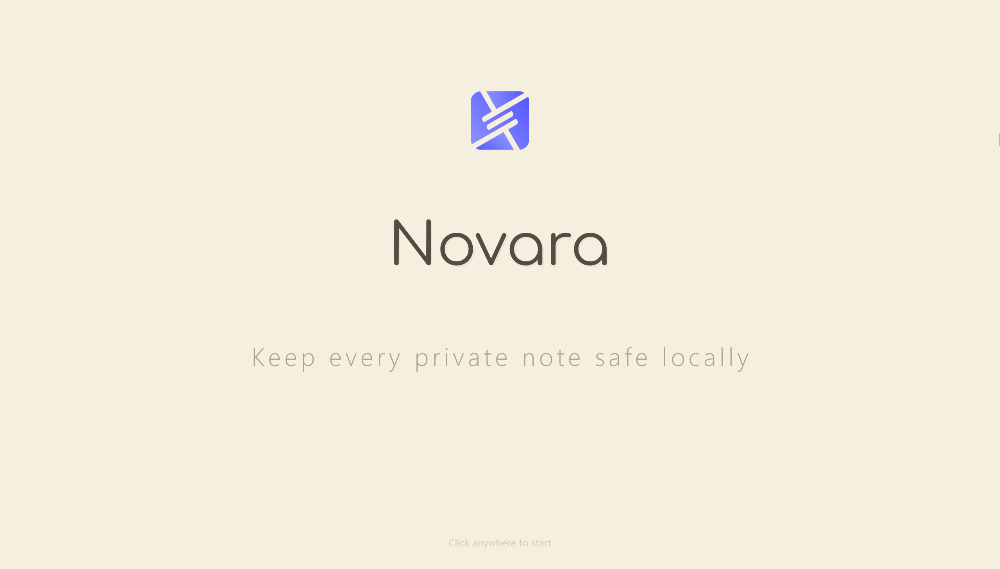
  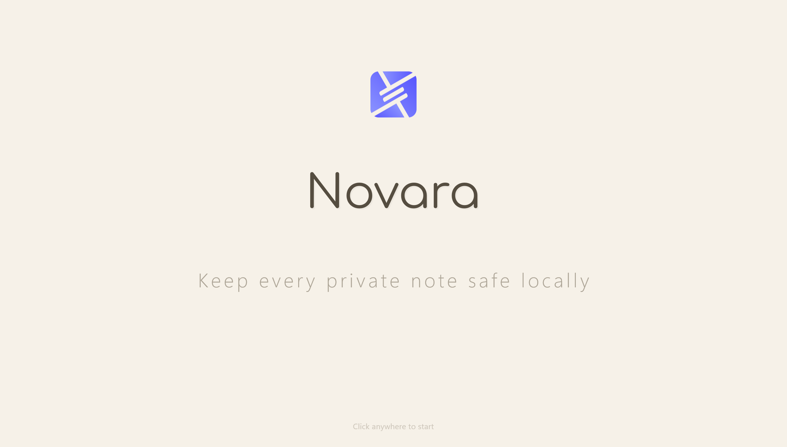

  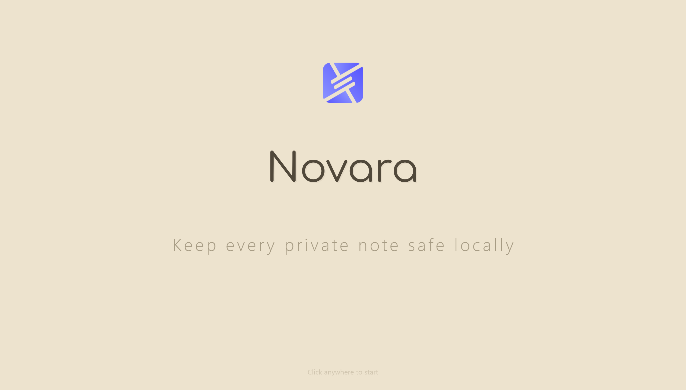
  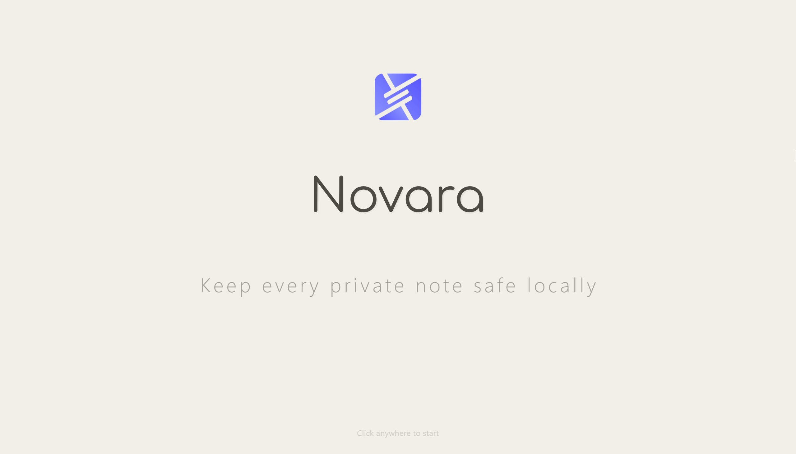

## Settings, Tools & Data Overview

- **Settings** — every switch in one place: themes (dark, light, paper), the animation toggle, autostart, the privacy lock with Windows Hello and auto-lock, MCP permissions, and the in-app update checker
- **Tools** — the API connectivity tests for memo entries, with a relay probe and per-endpoint diagnostics, plus the data-overview health card
- **Data overview** — encryption status, latest backup, snapshot count, file integrity, and orphan references at a glance

  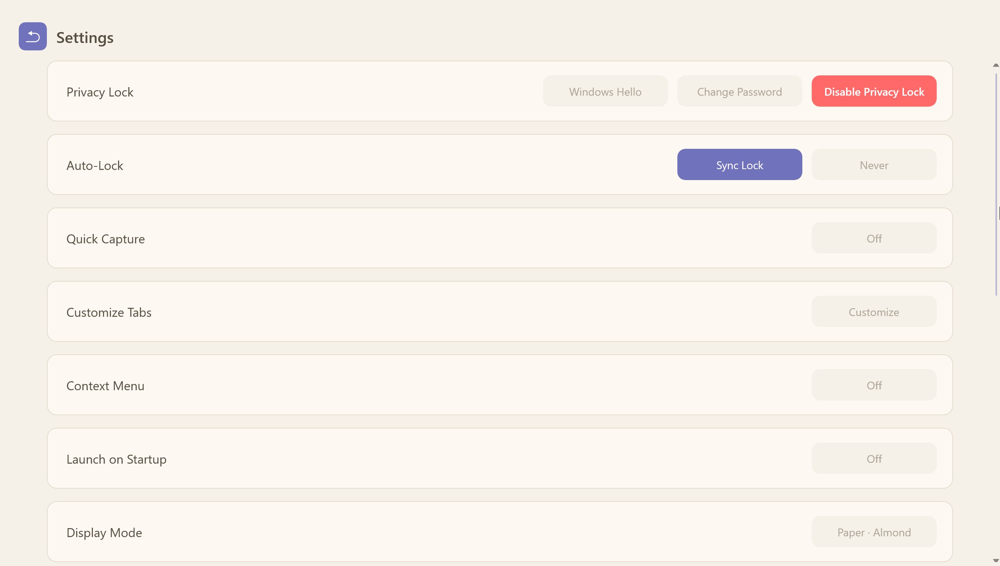
  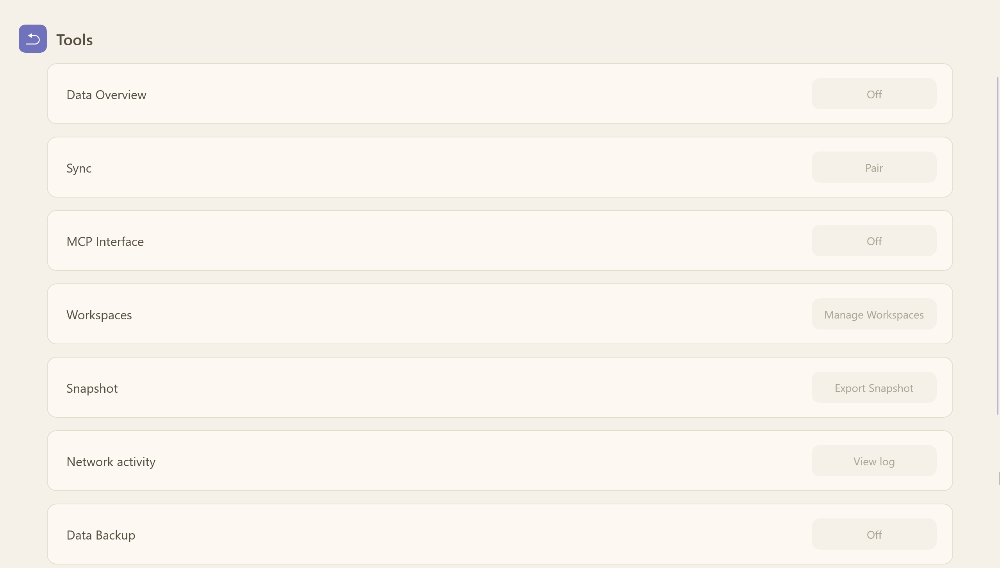

  

## Data Import & Export

Your data moves with you, freely and without vendor lock-in:

- **Encrypted backups** — export an authenticated `.novaenc` container protected by a separate backup password; plaintext exports warn when your vault is encrypted
- **Native backup** — plaintext `.novabak` export with a SHA-256 integrity header (older MD5-headered files still import); path entries excluded by default for new-machine migration
- **CSV import/export** — auto-detects Novara, KeePass, Bitwarden, and the Firefox / Chrome / 1Password / Proton Pass dialects for migrating credentials
- **PDF / HTML collection** — export all records as a printable HTML or PDF collection
- **Markdown export** — per-entry Markdown, with or without images
- **Rolling auto-backup** — up to 10 local snapshots you can restore from

## Startup, Tray & System Integration

- **Auto-start with Windows** — your workspace is ready when you log in
- **System tray mode** — keep Novara running silently in the background
- **Quick Capture** — Ctrl+Shift+N from anywhere: a small overlay takes the text and dispatches it to a memo, todo, or note
- **Global right-click menu** — add any folder/file to path backups from Explorer, or open Novara from the desktop
- **Desktop reminders** — countdown cards keep working even when the app is closed

## Data & Privacy at a Glance

- **Local-first**: everything stays on your machine — no cloud, no telemetry, no account
- **Authenticated encryption**: AES-256-GCM with PBKDF2 key derivation (3,000,000 iterations since format v3)
- **Ciphertext-only servers**: in the connected era, anything that leaves your machine is encrypted first — a server only ever stores or relays ciphertext
- **Sync you host**: cross-device sync runs through your own server, which holds no keys and can be rebuilt from your PC at any time
- **Portable single file**: `data.novadb` holds all seven partitions; optional password protects the whole database
- **Health check**: encryption status, latest backup, snapshot count, file integrity, and orphan references at a glance
- **Recoverable deletes**: the recycle bin gives you a week before anything is truly gone
- **Agent-ready without data leaks**: the MCP interface never sends your data anywhere by itself

## Privacy & Security

- **Privacy Policy** — [English](PRIVACY.md) · [简体中文](PRIVACY.zh-CN.md)
- **Security Policy** — [English](SECURITY.md) · [简体中文](SECURITY.zh-CN.md)

## Code signing policy

Free code signing provided by SignPath.io, certificate by SignPath Foundation. Authors, reviewers and approvers: [@Novara-owner](https://github.com/Novara-owner). Privacy policy: [PRIVACY.md](PRIVACY.md). Full policy: [docs/CODE_SIGNING_POLICY.md](docs/CODE_SIGNING_POLICY.md).

## License

Novara is released under the [MIT License](LICENSE.md).

---

Novara is free to use and designed to stay that way. For the latest releases and the official guide, visit **novara.xin**.
