<h1 align="center">Novara</h1>

<a href="README.md">English</a> · <strong>简体中文</strong>

  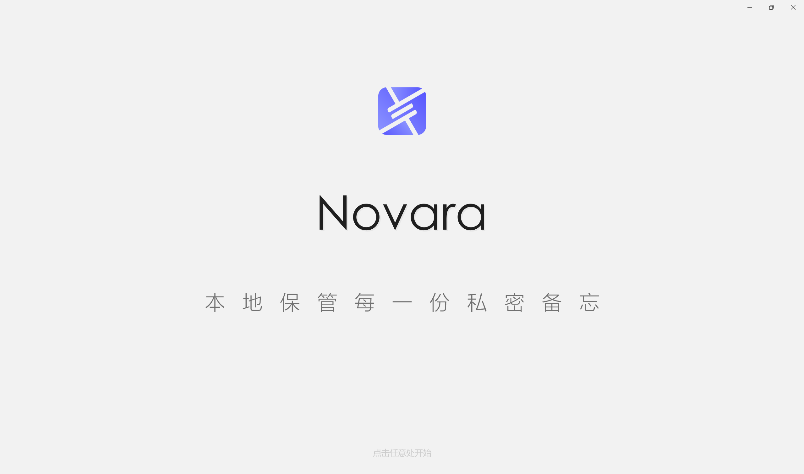

---

Novara 是一款面向 Windows 的**本地优先、注重隐私的个人知识管理工具**，基于 C# 与 WinUI 3 构建。它将备忘、路径备份、待办、桌面便签与富文本记录整合进一个加密数据库——**全部数据只存在你自己的电脑上，无云端上传、无遥测、无账号注册**。

数据保存在 `%LocalAppData%\Novara\` 下的便携单文件数据库中，可选 **AES-256-GCM 认证加密** 保护，密码最长 64 位。无论是管理日常笔记、跟踪项目任务、保存常用路径、撰写私密日记、存储带检测功能的 API Key，还是通过 MCP 把你的知识库交给 AI 助手打理，Novara 都能在一个快速、原生、稳定离线的应用里帮你搞定。

---

## 5.0 新特性

- **MCP Agent 接口** —— 14 个工具，让 AI 助手创建、读取、修改、列出、搜索你的卡片，带令牌鉴权与敏感字段脱敏
- **记录页** —— HTML 日记与 Markdown 文档共处一页，源码 / 预览分屏编辑
- **API 中转站探针** —— 检测中转站的模型偷换、「掺水」与投毒（8 项加权探针）
- **8 种备忘条目类型** —— 在邮箱、账户、API Key、网站、自定义之外，新增银行卡、WiFi、证件
- **CSV 导入/导出** —— 自动识别 Novara、KeePass、Bitwarden 三种格式
- **PDF / HTML 合集导出**、**索引化模糊全局搜索**、**Windows Hello 解锁**、**滚动自动备份**

## 安全与隐私锁

可选密码保护，基于 **AES-256-GCM 认证加密**。开启后，整个数据库在静止状态下加密——没有正确密码，任何备忘、路径、待办、便签、记录都无法读取。密码支持 **6 至 64 位**，绝不明文存储（本地仅保存加盐 SHA-256 哈希）。无后门、无找回机制、无云端依赖——忘记密码的唯一出路是清空数据库重新开始。

GCM 提供**认证加密**：加密文件被篡改会被密码学标签立即发现，损坏或被修改的数据会被明确报告，而不是被静默误读。由 Novara 2.0（旧版 AES-CBC）创建的数据库，在首次解锁确认一次后即可无缝迁移到新格式。

安全机制还包括 **连续 5 次输错锁定 30 分钟**——计数与锁定状态跨重启持久化，并用单调时钟抵御系统时间回拨。自 5.0 起，你还可用 **Windows Hello**（生物识别 / PIN）解锁。锁屏跟随系统主题、全屏遮挡应用、窗口失焦自动清空输入框。

  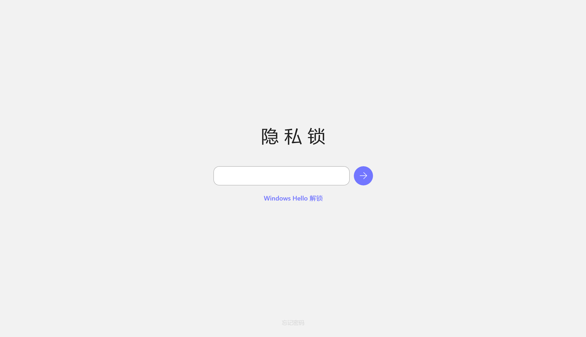
  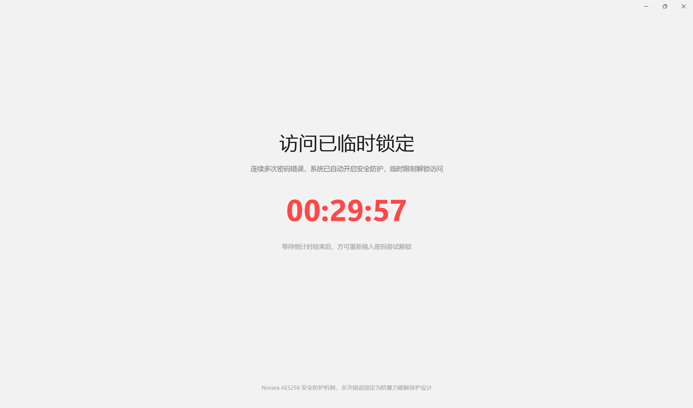

## 备忘管理

存放所有备忘的主页——Novara 的核心中枢。你可以把条目组织进自定义分组，星标或置顶重要条目以便快速访问，并通过右键菜单在分组间移动。

八种内置条目类型覆盖绝大多数场景：

- **邮箱**：地址 + 密码
- **账户**：账号 + 密码
- **API Key**：Key + 接口 URL + 模型 ID
- **网站**：名称 + 网址
- **银行卡**：卡片信息
- **WiFi**：网络凭证
- **证件**：证件信息
- **自定义**：无限灵活的键值字段

星标与置顶条目置顶显示，每张卡片第二行展示关键信息，一眼识别。

  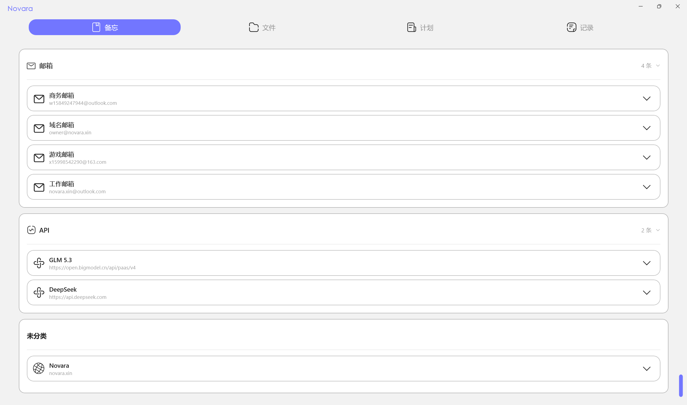

### API Key 管理与检测

每个 API Key 条目都内置**三级检测**系统，全部只针对你配置的端点运行——你的 Key 除发往该端点外绝不离开本机：

| 层级 | 功能 | Token 消耗 |
|------|------|-----------|
| **接口连通检测** | 探测 `GET /v1/models`，验证 Key 是否有效 | 0 |
| **接口状态诊断** | 推断有无余额、读取元数据、测量延迟 / TTFT | 1–3 |
| **中转站探针检测** | 8 项加权探针，检测模型偷换、「掺水」与投毒 | 数十~上百 |

中转站探针是 Novara 面向 API 中转时代的招牌能力：它发送随机化、带 nonce 的测试提示，交叉校验**身份真伪**、**能力基准**、**格式遵从**、**token 计费**、**工具调用**、**隐藏注入**、**响应投毒**、**长上下文截断**八项，再产出加权风险结论（可信 / 基本可信 / 疑似风险 / 高风险）。探针数据存放在本地可更新的 `ProbeDataSet.json` 中，所有结果都附固定免责声明——这是概率性自查，不构成法律凭证。

  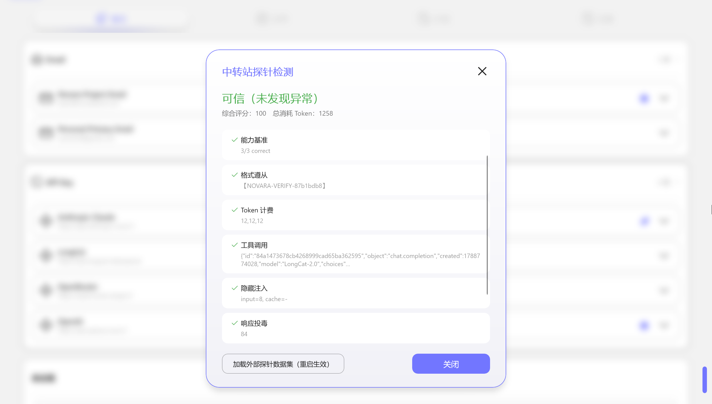

## 路径备份

专门用于保存与管理常用文件/文件夹路径。一键复制路径，另一键在资源管理器中打开并高亮。新建或编辑时，可手动输入，也可用内置文件/文件夹选择器直接选取。

Novara 持续校验每条已保存路径并给出即时视觉反馈：**绿色边框**表示存在，**红色边框**表示缺失或不可访问。检测在五种场景自动触发：新建/编辑、30 分钟定时、启动、空白区全量检测、单卡右键。

  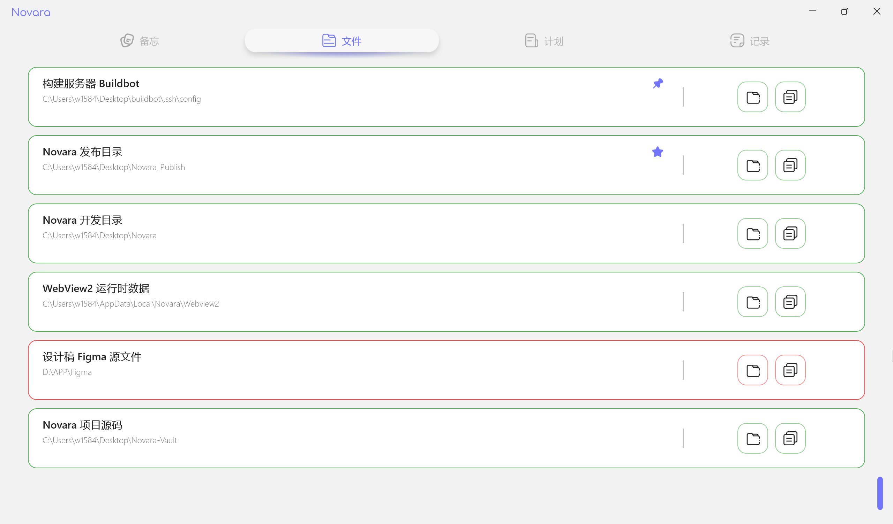

## 任务面板

一个轻量的生产力看板，把待办、便签与定时提醒整合在一处。

- **待办卡片**：主待办 + 可选子待办，智能联动——子待办全勾自动完成主待办，取消任一子待办重新展开。状态跨重启持久化。
- **便签**：快速非结构化笔记；内容超长或含换行时显示展开按钮。
- **系统提醒**：空白处右键添加倒计时卡片，到点响铃、脉冲、自动关闭，主程序关闭也能工作。

  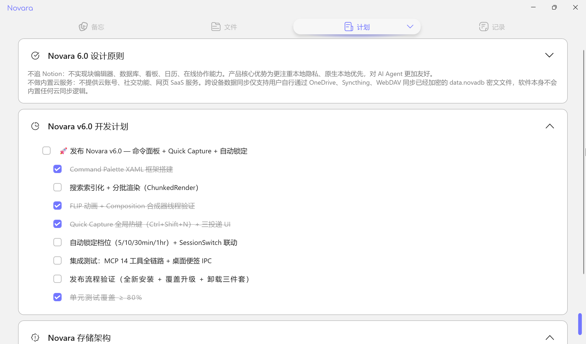

## 桌面便签

一键把任意便签或待办卡发送到桌面。轻量独立进程（**StickNoteHost**）让便签在主程序关闭后依然可见：

- **拖动与缩放**：解锁后可任意移动、从任意边缘调整大小
- **锁定置顶**：固定位置、保持置顶、不被 Win+D 隐藏
- **主题与语言同步**：便签即时跟随应用主题与语言
- **桌面编辑**：右键便签，Novara 自动打开对应编辑弹窗
- **待办双向同步**：桌面勾选写回主程序，主程序始终是唯一数据权威

  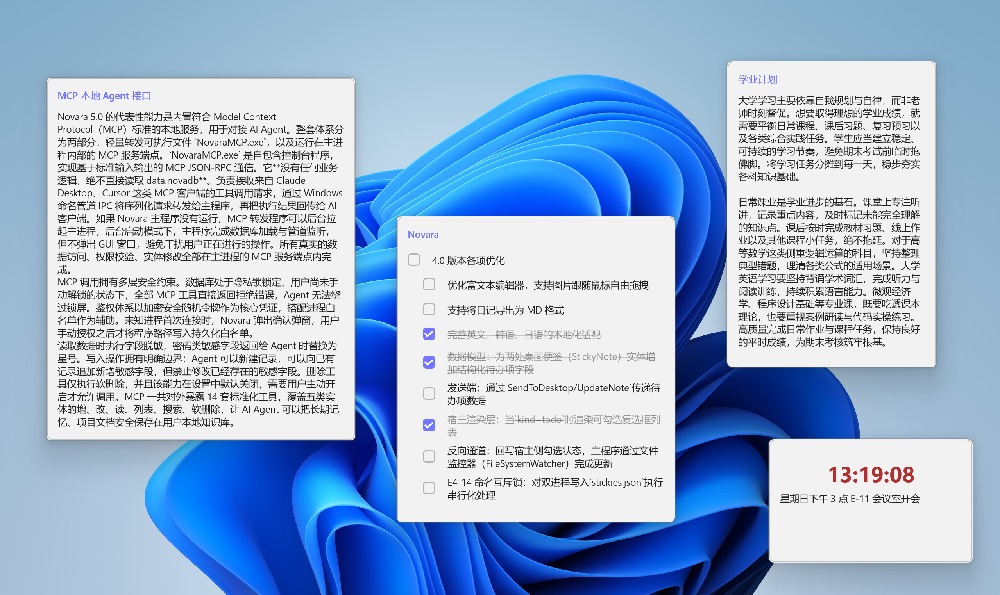

## 记录页

一个承载两种格式的完整长文本平台：

- **HTML 日记**：富文本编辑器（WebView2 + Tiptap），支持加粗、斜体、下划线、改色、插图、链接；悬浮胶囊工具栏、图片拖拽调整、自动保存、双重 HTML 净化抵御 XSS
- **Markdown 文档**：源码 / 预览分屏编辑器（WebView2 + markdown-it），实时预览，适合项目笔记、会议纪要、知识库页面
- **导入 Markdown**：把已有 `.md` 文件收进来，你和 AI 助手都能读、能改

筛选栏（混合 / 日记 / 文档）与格式徽标让一切井井有条。标题以纯文本渲染，限 120 字。

  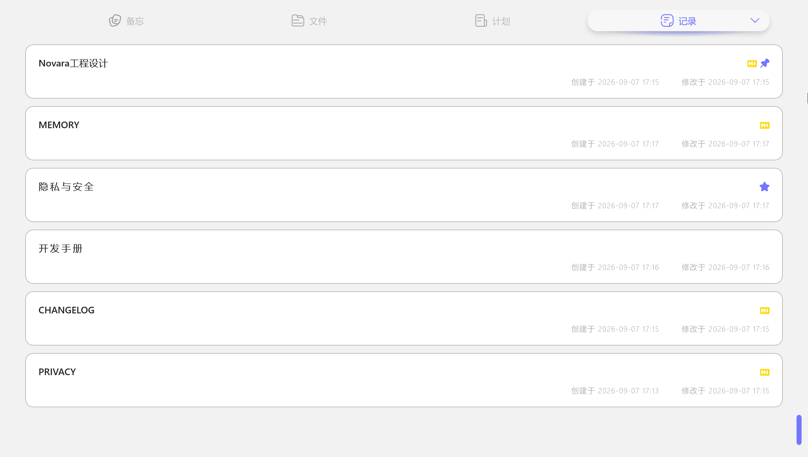

  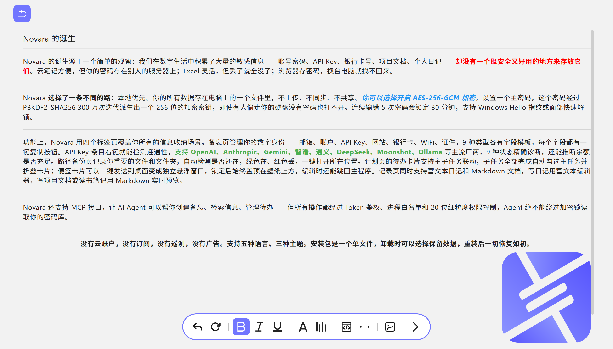
  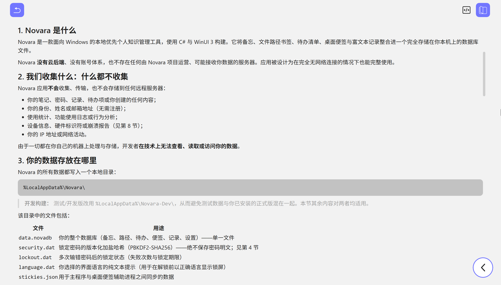

## 全局搜索

任意界面按下 **Ctrl+K**，一键聚合搜索备忘、路径、待办、便签、记录。自 5.0 起，搜索**索引化**提速，并支持**模糊匹配**（子序列匹配，如 "memo" 命中 "memorandum"），标题命中优先。点击结果直接跳转——自动切页、滚动定位、品牌色脉冲标记落点。

  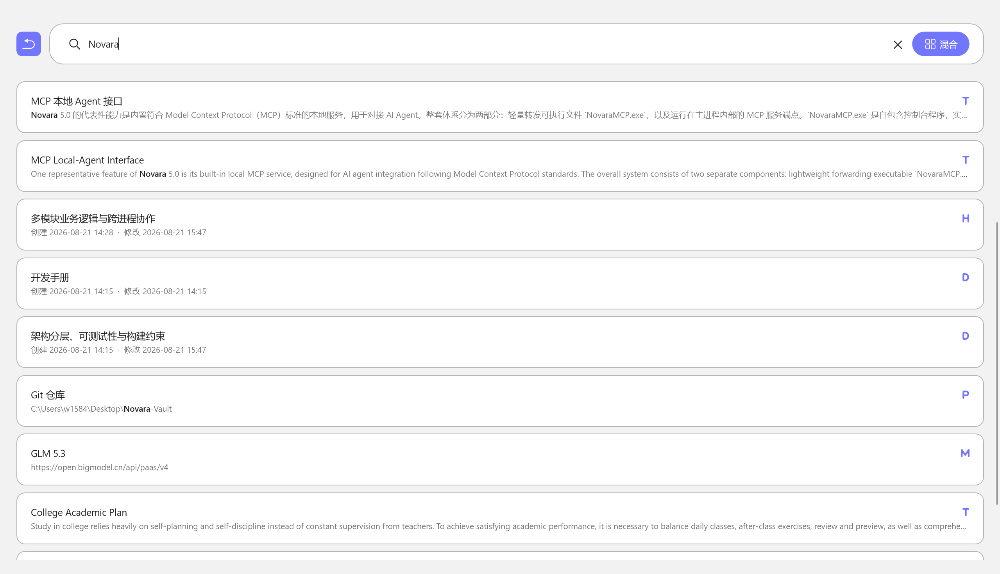

## 回收站

删除的卡片不会瞬间消失——移入**回收站**并支持 **7 天自动清理**，一周内可恢复，超期后下次启动永久删除。支持恢复、永久删除（红色二次确认）、清空，以及按时间倒序混合展示。回收站数据不参与导出。

  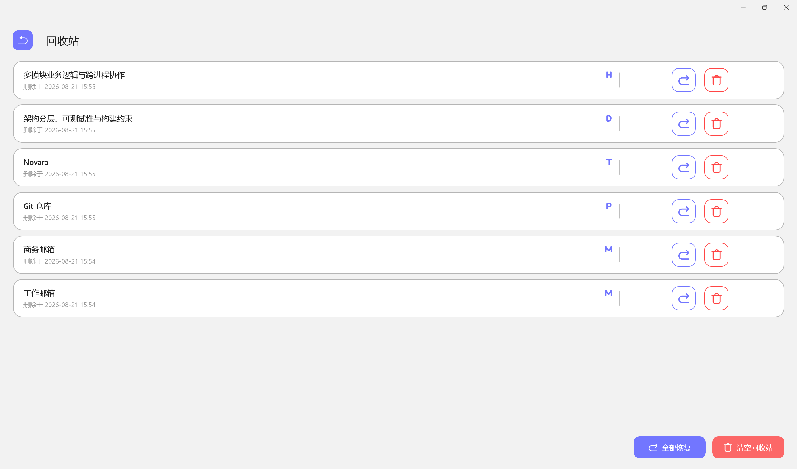

## MCP Agent 接口

Novara 内置原生 **MCP 服务器**（Model Context Protocol），让任何 AI 助手——Claude、编程助手或自定义 Agent——都能作为一等客户端操作你的知识库。它以独立的 **`NovaraMCP.exe`** 形式发布，使用 stdio JSON-RPC 2.0 协议，把每个调用转发给运行中的 Novara 主程序（唯一数据权威）。

**14 个工具**，覆盖五类数据（`memo` / `todo` / `note` / `diary` / `path`）：

- `create_memo` · `create_todo` · `create_note` · `create_diary` · `create_path`
- `update_memo` · `update_todo` · `update_note` · `update_diary` · `update_path`
- `delete_item` · `list_items` · `read_item` · `search_items`

**安全模型**（在设置页 → MCP 卡片开启）：

- **默认关闭** —— 你主动开启，然后复制令牌
- **令牌鉴权** —— 固定时间比较；通过 `NOVARA_MCP_TOKEN` 或 `--token` 传入
- **解锁门控** —— 数据库必须已解锁；锁着/加密时拒绝一切请求
- **进程白名单** —— 任何进程首次连接都需你显式授权
- **删除独立权限** —— 删除操作单独一个开关
- **敏感字段脱敏** —— 密码/密钥/token 字段读出为 `****`，搜索不命中，且无法靠改名绕过脱敏

完整工具参考与客户端配置见 [`docs/MCP.md`](docs/MCP.md)。

## 五语言界面

Novara 内置**五种完整界面语言**——简体中文、繁體中文、English、한국어、日本語——并提供「跟随系统」选项。切换后应用重启即全量翻译；你的数据始终语言无关。

## 主题系统

浅色、深色、跟随系统三套主题，统一品牌按钮体系（主蓝 / 幽灵描边 / 危险红），全应用每个弹窗保持一致。

  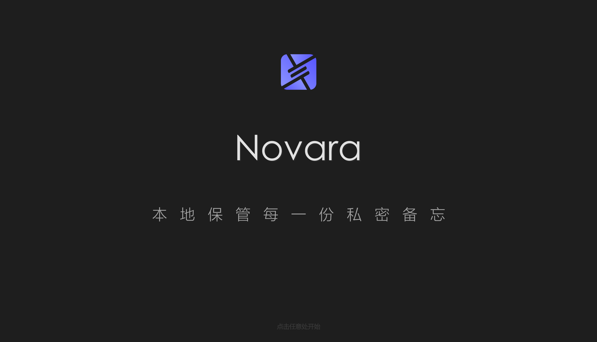

## 数据导入与导出

你的数据随你自由迁移，无供应商锁定：

- **原生备份**：明文 `.novabak` 导出，带 MD5 完整性头；换机迁移时路径条目默认排除
- **CSV 导入/导出**：自动识别 Novara、KeePass、Bitwarden 三种方言，方便迁移凭证
- **PDF / HTML 合集**：把全部记录导出为可打印的 HTML 或 PDF 合集
- **Markdown 导出**：单篇 Markdown，可含 / 不含图片
- **滚动自动备份**：最多 10 份可恢复的本地快照

## 启动、托盘与系统集成

- **开机自启**：登录时工作区即就绪
- **系统托盘模式**：让 Novara 在后台安静常驻
- **全局右键菜单**：在资源管理器中右键任意文件/文件夹即可加入路径备份，或右键桌面直接打开 Novara
- **桌面提醒**：倒计时卡片在主程序关闭后依然工作

## 数据与隐私一览

- **本地优先**：一切只存在你的电脑上——无云、无遥测、无账号
- **认证加密**：AES-256-GCM + PBKDF2 密钥派生（10 万次迭代）
- **便携单文件**：`data.novadb` 承载全部七个分区；可选密码保护整个数据库
- **可恢复删除**：回收站给你一周时间，任何内容才真正消失
- **Agent 就绪而不泄密**：MCP 接口自身绝不把你的数据发往任何地方

## 隐私与安全

- **隐私政策** — [English](PRIVACY.md) · [简体中文](PRIVACY.zh-CN.md)
- **安全说明** — [English](SECURITY.md) · [简体中文](SECURITY.zh-CN.md)

## 许可证

Novara 依据 [MIT 许可证](LICENSE.md) 开源发布。

---

Novara 免费使用，并将保持免费。最新版本与官方使用教程请访问 **novara.xin**。
