<h1 align="center">Novara</h1>

<a href="README.md">English</a> · <strong>简体中文</strong>

  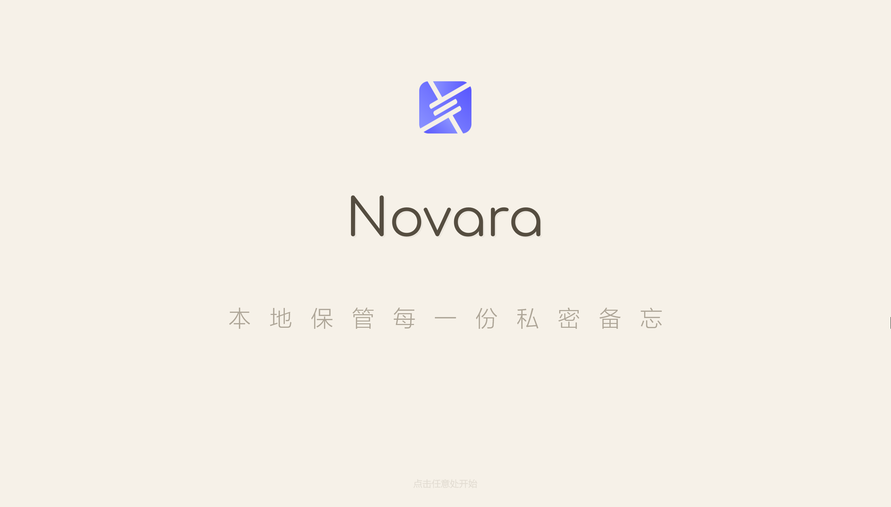

---

Novara 是一个**本地优先的个人数据控制层——为你，也为你的 AI**，基于 C# 与 WinUI 3 构建。你的数据以单个加密数据库的形式只存在你自己的电脑上——**无云端上传、无遥测、无账号注册**。你的 AI 可以通过带权限校验的接口使用这些数据；从 7.0 起，数据开始可以跟着你走：随处可读的加密快照。8.0 起更可以**在你自己托管的服务器上跨设备同步**——无账号、无官方云，服务器依旧只经手密文，明文永远不离开你的控制。

不是密码管理器，也不是笔记软件——**AI 时代的个人数据控制层：你和你的 AI 都能使用数据，但钥匙只在你的手里。**

今天，这层数据控制以备忘（内置 API Key 连通检测）、路径备份、待办、桌面便签与富文本记录的形态工作，全部装在一个快速、原生、完全离线可用的应用里。数据保存在 `%LocalAppData%\Novara\` 下的便携单文件数据库中，可选 **AES-256-GCM 认证加密**保护，密码最长 64 位。

---

## 8.0 — 同步，跑在你自己的服务器上

8.0 让互联时代变成双向。Novara 现在可以**在你的多台设备之间同步**，经由一台由你自己运行的服务器——而服务器依旧看不到你的数据：它只保管带版本号的密文块，对内容一无所知。配对第二台设备只需三个值（服务器地址、空间 id、注册密钥），而空间密钥在你的第一台设备上生成、永远不离开你的控制。电脑始终是权威副本——服务器丢了，从电脑推一次即可重建。离线能力永不倒退：服务器宕机不影响 Novara 的任何功能。

- **跨设备同步** —— 一份加密状态，在所有已配对设备上收敛
- **随包自带的自托管服务端** —— 安装包内含 `NovaraSync.exe`（单文件自包含，服务器那台机器无需安装 .NET 运行时），外加两个一键脚本替你钉好数据目录
- **网页阅读器与受限编辑器** —— 与 7.0 同一个自包含查看器，现在能从你的服务器加载实时密文，并做受限编辑（备忘／待办／便签），上传前重新加密
- **诚实的冲突处理** —— 后写者胜，先写的那一版作为冲突副本保留，可对比、可留存、可导出
- **设备中心与同步历史** —— 看清每一台已配对设备，撤销丢失手机的 token，本地审计日志逐条记录每次上传、下载与冲突

## 安全与隐私锁

可选密码保护，基于 **AES-256-GCM 认证加密**。开启后，整个数据库在静止状态下加密——没有正确密码，任何备忘、路径、待办、便签、记录都无法读取。密码支持 **6 至 64 位**，绝不明文存储：本地仅保存加盐、版本化的哈希（自第二版起为 PBKDF2-SHA256、3,000,000 次迭代）。无后门、无找回机制、无云端依赖——忘记密码的唯一出路是清空数据库重新开始。

GCM 提供**认证加密**：加密文件被篡改会被密码学标签立即发现，损坏或被修改的数据会被明确报告，而不是被静默误读。旧数据库可原地升级：2.0 时代的 AES-CBC 格式经一次确认迁移到 GCM；自 5.3 起，密钥派生经一次性选择权弹窗校准至 **3,000,000 次 PBKDF2 迭代**（格式 v3）。

安全机制还包括 **连续 5 次输错锁定 30 分钟**——计数与锁定状态跨重启持久化，并用单调时钟抵御系统时间回拨。自 5.0 起，你还可用 **Windows Hello**（生物识别 / PIN）解锁；自 5.1 起，保险库也能自己锁上：按需（**Ctrl+Shift+L**）、按你选择的空闲时长、或 Windows 锁屏时联动锁定。锁屏跟随系统主题、全屏遮挡应用、窗口失焦自动清空输入框。

  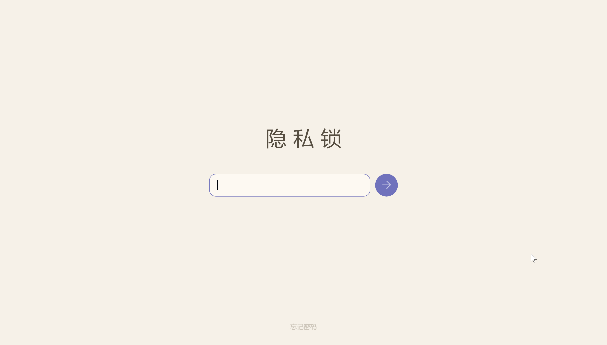
  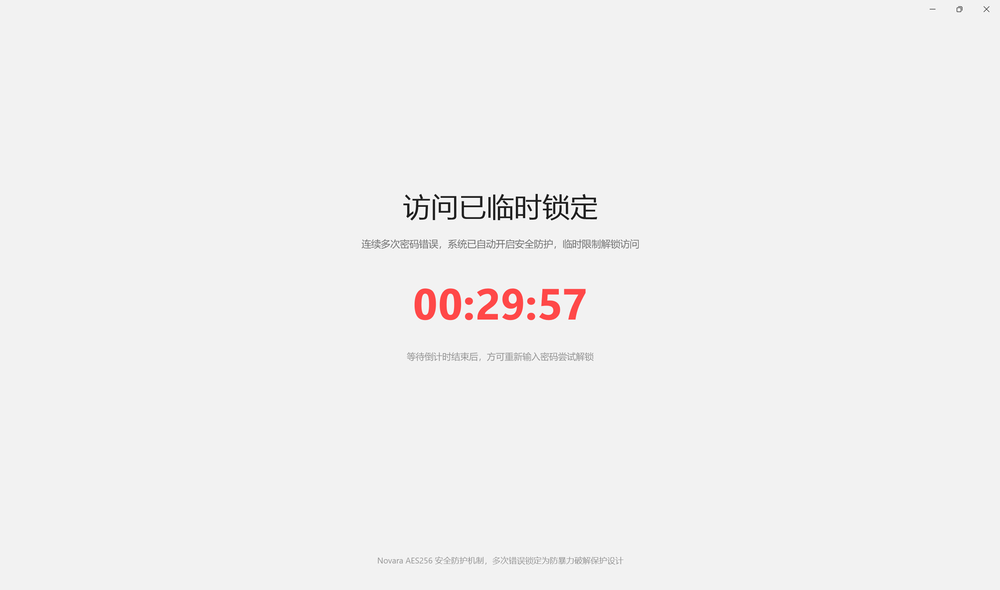

## 备忘管理

存放所有备忘的主页——Novara 的核心中枢。你可以把条目组织进自定义分组，星标或置顶重要条目以便快速访问，并通过右键菜单在分组间移动。

八种内置条目类型覆盖绝大多数场景：

- **邮箱**：地址 + 密码
- **账户**：账号 + 密码
- **API Key**：Key + 接口 URL + 模型 ID
- **网站**：名称 + 网址
- **银行卡**：卡片信息
- **WiFi**：网络凭证
- **证件**：证件信息
- **自定义**：无限灵活的键值字段

星标与置顶条目置顶显示，每张卡片第二行展示关键信息，一眼识别。敏感字段行都带一键复制按钮，条目对话框内还能直接生成随机密码、UUID 与 Token。

邮箱、账户、网站、WiFi 条目还可写入 **TOTP 密钥**（粘贴 `otpauth://` URI 或 Base32 密钥）：卡片即显示实时 6 位动态码、剩余秒数、倒计时进度条与一键复制——不掏手机也能有两步验证。

  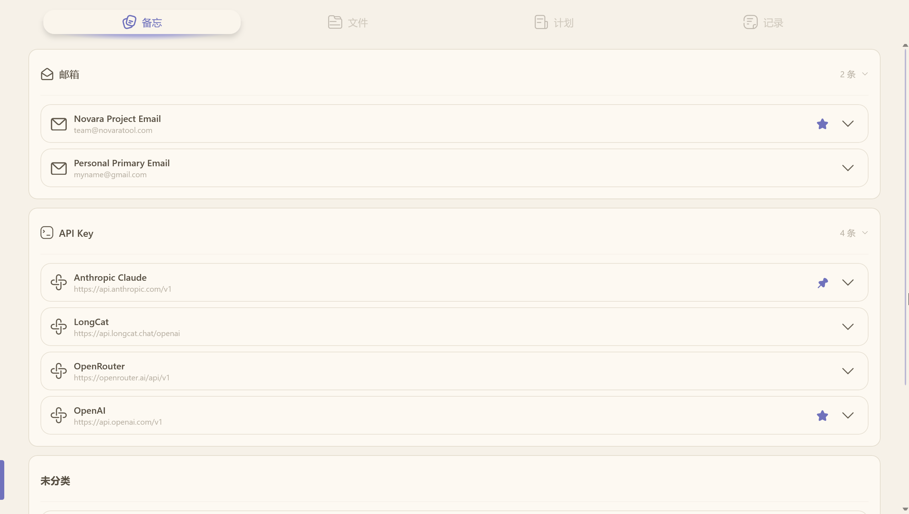

### API Key 管理与检测

每个 API Key 条目都内置**三级检测**系统，全部只针对你配置的端点运行——你的 Key 除发往该端点外绝不离开本机：

| 层级 | 功能 | Token 消耗 |
|------|------|-----------|
| **接口连通检测** | 探测 `GET /v1/models`，验证 Key 是否有效 | 0 |
| **接口状态诊断** | 推断有无余额、读取元数据、测量延迟 / TTFT | 1–3 |
| **中转站探针检测** | 8 项加权探针，检测模型偷换、「掺水」与投毒 | 数十~上百 |

中转站探针是 Novara 面向 API 中转时代的招牌能力：它发送随机化、带 nonce 的测试提示，交叉校验**身份真伪**、**能力基准**、**格式遵从**、**token 计费**、**工具调用**、**隐藏注入**、**响应投毒**、**长上下文截断**八项，再产出加权风险结论（可信 / 基本可信 / 疑似风险 / 高风险）。探针数据存放在本地可更新的 `ProbeDataSet.json` 中，所有结果都附固定免责声明——这是概率性自查，不构成法律凭证。

  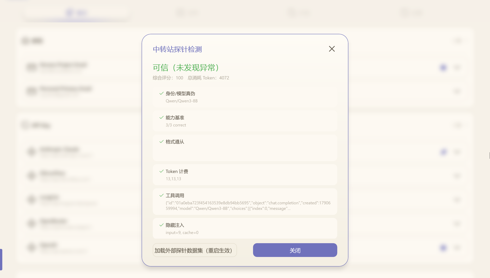

## 路径备份

专门用于保存与管理常用文件/文件夹路径。一键复制路径，另一键在资源管理器中打开并高亮。新建或编辑时，可手动输入，也可用内置文件/文件夹选择器直接选取。

Novara 持续校验每条已保存路径并给出即时视觉反馈：**绿色边框**表示存在，**红色边框**表示缺失或不可访问。检测在五种场景自动触发：新建/编辑、30 分钟定时、启动、空白区全量检测、单卡右键。

  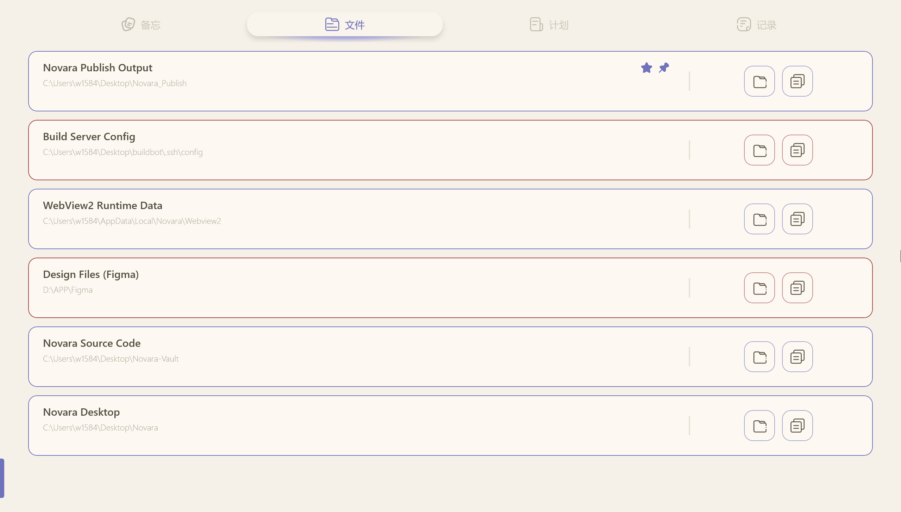

## 任务面板

一个轻量的生产力看板，把待办、便签与定时提醒整合在一处。

- **待办卡片**：主待办 + 可选子待办，智能联动——子待办全勾自动完成主待办，取消任一子待办重新展开。状态跨重启持久化。
- **便签**：快速非结构化笔记；内容超长或含换行时显示展开按钮。
- **系统提醒**：空白处右键添加倒计时卡片，到点响铃、脉冲、自动关闭，主程序关闭也能工作。

  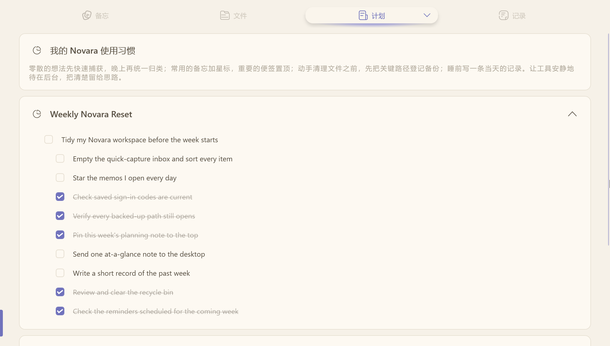

## 桌面便签

一键把任意便签或待办卡发送到桌面。轻量独立进程（**StickNoteHost**）让便签在主程序关闭后依然可见：

- **拖动与缩放**：解锁后可任意移动、从任意边缘调整大小
- **锁定置顶**：固定位置、保持置顶、不被 Win+D 隐藏
- **主题与语言同步**：便签即时跟随应用主题与语言
- **桌面编辑**：右键便签，Novara 自动打开对应编辑弹窗
- **待办双向同步**：桌面勾选写回主程序，主程序始终是唯一数据权威

  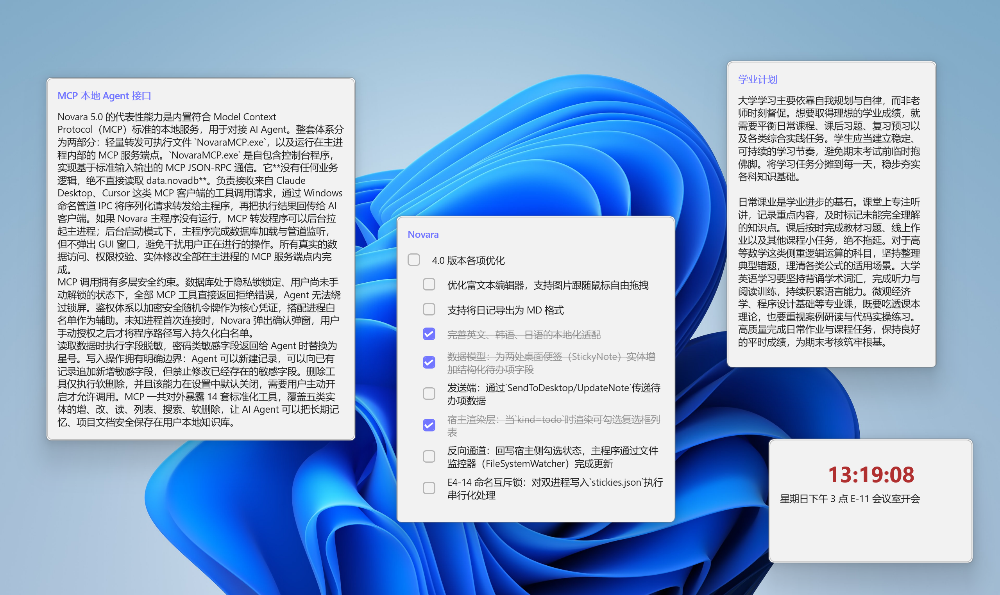

## 记录页

一个承载两种格式的完整长文本平台：

- **HTML 日记**：富文本编辑器（WebView2 + Tiptap），支持加粗、斜体、下划线、改色、插图、链接；悬浮胶囊工具栏、图片拖拽调整、自动保存、双重 HTML 净化抵御 XSS
- **Markdown 文档**：源码 / 预览分屏编辑器（WebView2 + markdown-it），实时预览，适合项目笔记、会议纪要、知识库页面
- **导入 Markdown**：把已有 `.md` 文件收进来，你和 AI 助手都能读、能改

筛选栏（混合 / 日记 / 文档）与格式徽标让一切井井有条。标题以纯文本渲染，限 120 字。

  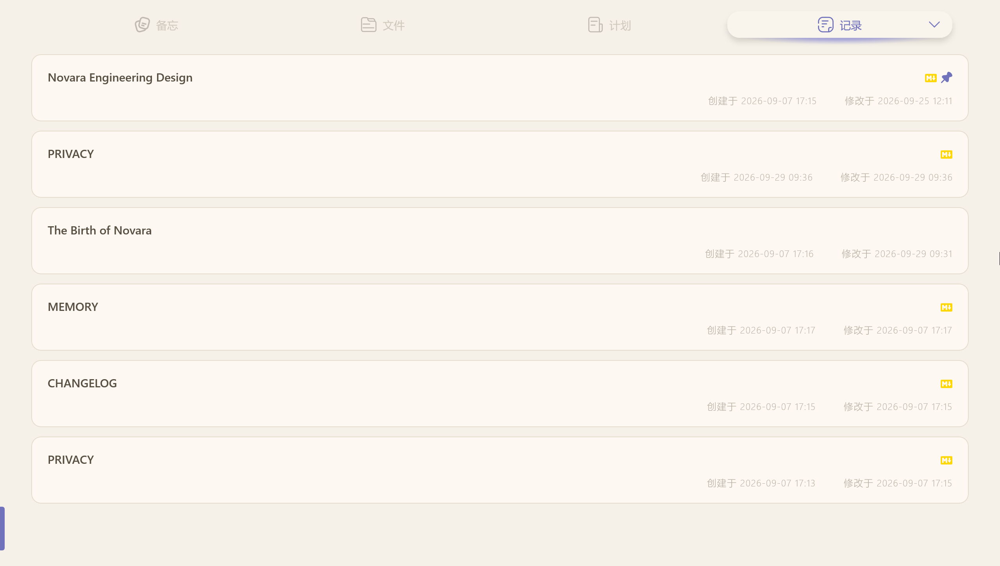

  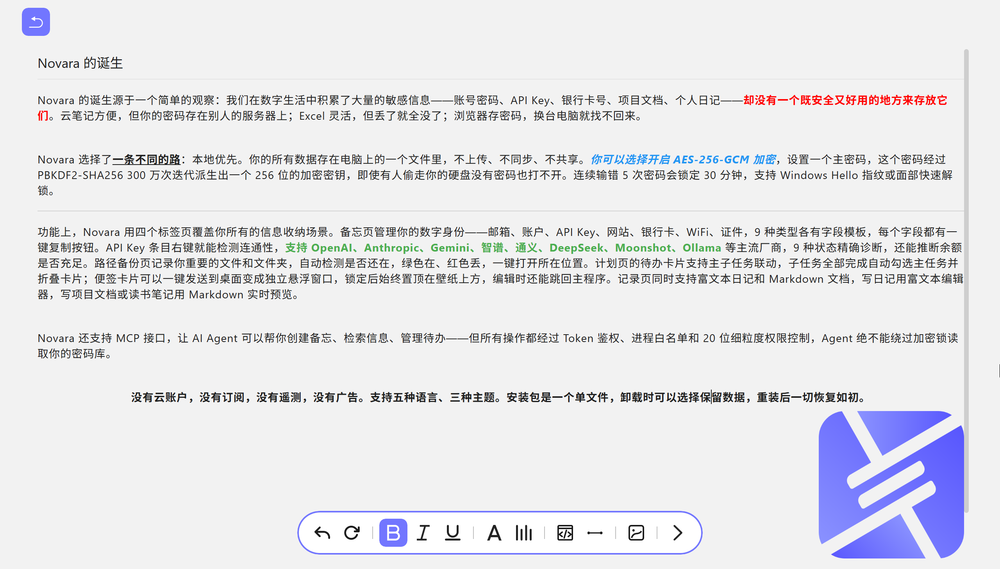
  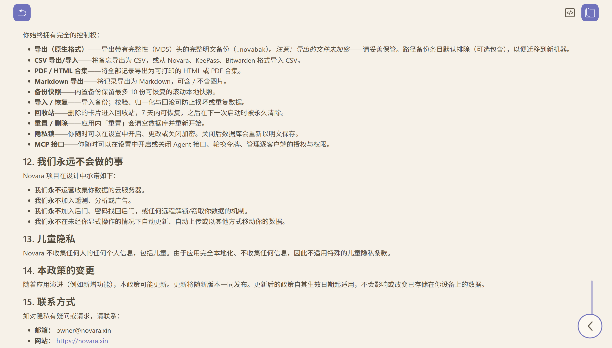

## Novara Snapshot

互联时代的第一步。把你的整个数据库——备忘、路径、待办、便签、记录，由你选择——导出为**一个自包含的加密 HTML 文件**，随处只读查看：

- **随处打开** —— 双击文件即可，或托管到你自己的 NAS / 服务器 / 任意静态托管；查看器、解密、数据全在那一个文件里
- **端到端加密** —— 与加密备份同一个 `.novaenc` AES-256-GCM 容器（PBKDF2-SHA256，3,000,000 次迭代）；明文库拒绝导出，没有例外
- **密码是唯一的钥匙** —— 密码不存储、不发送、无法找回；拿到文件的人面对锁着的快照，看到的只是一堆噪声
- **只读是设计而非限制** —— 字段默认掩码、点击显示、一键复制、动态码在浏览器本地实时计算；不能编辑、不上传、不持久化（刷新后明文即从内存消失）
- **诚实的数据截至** —— 查看器明确标注快照时间；更新数据 = 重新导出

自己托管，或发给你信任的人——文件和密码分开两条路走。

  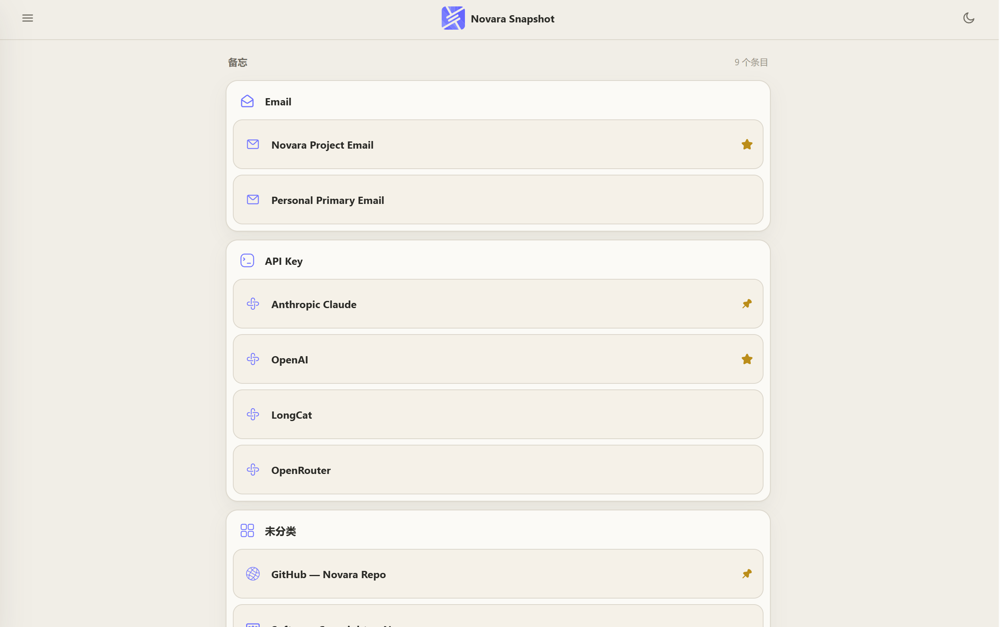

  

## 跨设备同步

同步让一份加密状态在你的设备之间持续收敛——并且它的设计前提是：服务器永远读不到内容。

- **你的服务器，你说了算** —— 在你自己的电脑、NAS 或 VPS 上运行 `NovaraSync`；它保存带版本号的密文与「空间／设备／版本」索引，不持有任何密钥、没有用户体系、没有遥测
- **配对** —— 服务器只在建空间时打印一次空间 id 与注册密钥；你在每台设备上填入它们与服务器地址。空间密钥在第一台设备上生成，永远不到达服务器
- **电脑仍是权威副本** —— 本地数据库始终是唯一真相来源；服务器清空后，从电脑推一次即可恢复
- **HTTPS 是内置要求** —— 浏览器侧需要安全上下文，故部署指南推荐一层 TLS 反代（Caddy，证书自动签发）或私有网络链路
- **冲突，如实相告** —— 两台设备改动同一版本时后写者胜；先写的那一版保留为冲突副本，不会有任何东西静默消失
- **设备与历史** —— 设备中心列出已配对设备的信任状态与最后同步时间，可撤销设备或重置其 token；每次同步事件都写进本地审计日志
- **离线能力永不倒退** —— 同步是增强，不是依赖

## 工作区

有时一份平铺列表不够用，但文件夹又太重。**工作区**是横跨备忘、路径、待办、便签、记录五类数据的虚拟筛选器：为一个项目建一个空间，把卡片划进去，切换空间即重塑所有列表。卡片从不在「文件夹」之间搬运——数据库保持扁平——卡片可以进入你的工作流，却不必被锁死在里面。

## 全局搜索

任意界面按下 **Ctrl+K**，一键聚合搜索备忘、路径、待办、便签、记录。搜索**索引化**提速，并支持**模糊匹配**（子序列匹配，如 "memo" 命中 "memorandum"），标题命中优先。点击结果直接跳转——自动切页、滚动定位、品牌色脉冲标记落点。

Ctrl+K 同时是**命令面板**：输入 `>` 后同一个输入框切换为命令模式——新建备忘 / 待办 / 便签 / 日记、打开回收站或设置、立即锁定。

  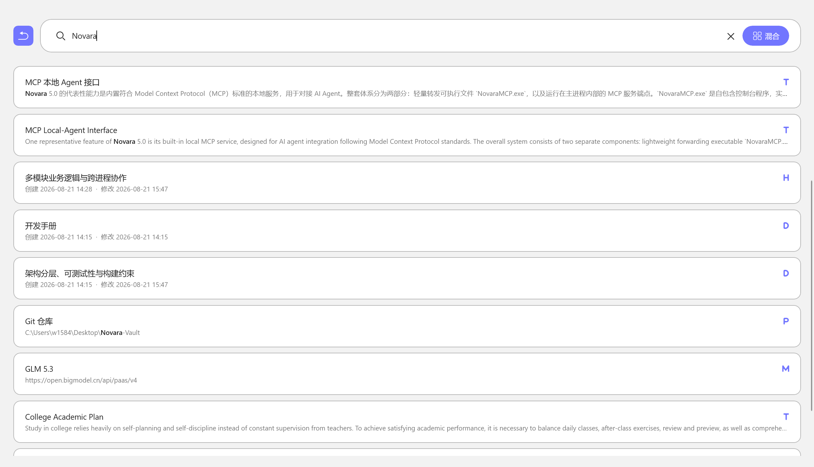

## 回收站

删除的卡片不会瞬间消失——移入**回收站**并支持 **7 天自动清理**，一周内可恢复，超期后下次启动永久删除。支持恢复、永久删除（红色二次确认）、清空，以及按时间倒序混合展示。回收站数据不参与导出。

  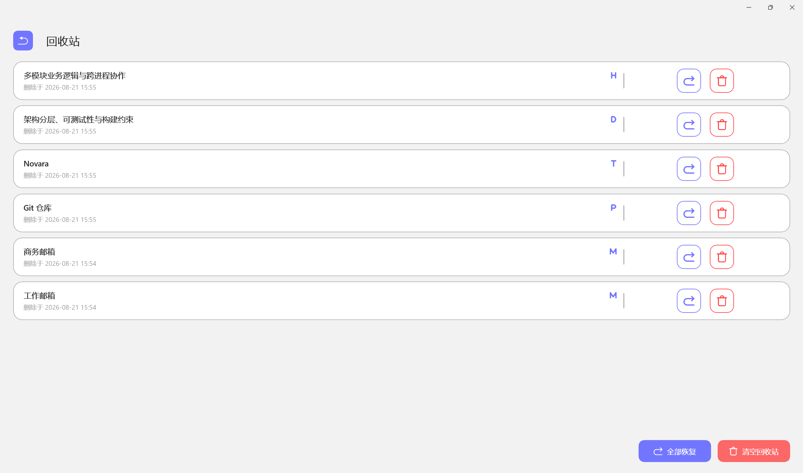

## MCP Agent 接口

Novara 内置原生 **MCP 服务器**（Model Context Protocol），让任何 AI 助手——Claude、编程助手或自定义 Agent——都能作为一等客户端操作你的知识库。它以独立的 **`NovaraMCP.exe`** 形式发布，使用 stdio JSON-RPC 2.0 协议，把每个调用转发给运行中的 Novara 主程序（唯一数据权威）。

**14 个工具**，覆盖五类数据（`memo` / `todo` / `note` / `diary` / `path`）：

- `create_memo` · `create_todo` · `create_note` · `create_diary` · `create_path`
- `update_memo` · `update_todo` · `update_note` · `update_diary` · `update_path`
- `delete_item` · `list_items` · `read_item` · `search_items`

**安全模型**（在设置页 → MCP 卡片开启）：

- **默认关闭** —— 你主动开启，然后复制令牌
- **令牌鉴权** —— 固定时间比较；通过 `NOVARA_MCP_TOKEN` 或 `--token` 传入
- **解锁门控** —— 数据库必须已解锁；锁着/加密时拒绝一切请求
- **逐客户端授权与权限** —— 任何进程首次连接都需你显式授权，且每个已授权客户端拥有独立的读 / 建 / 改 / 删 × 五类数据权限矩阵。新客户端除备忘外默认只读——凭证库是 Agent 最不该碰的东西，所以最先把住
- **删除总闸** —— 删除需要客户端自身权限位与全局总闸同时放行
- **审计日志** —— 每次调用（放行、脱敏或拒绝）都落本地日志。你的 AI 访问过什么，你始终知道
- **敏感字段脱敏** —— 密码/密钥/token 字段读出为 `****`，搜索不命中，且无法靠改名绕过脱敏

完整工具参考与客户端配置见 [`docs/MCP.md`](docs/MCP.md)。

## 五语言界面

Novara 内置**五种完整界面语言**——简体中文、繁體中文、English、한국어、日本語——并提供「跟随系统」选项。切换后应用重启即全量翻译；你的数据始终语言无关。

## 主题系统

浅色、深色、跟随系统三套主题，统一品牌按钮体系（主蓝 / 幽灵描边 / 危险红），全应用每个弹窗保持一致。

  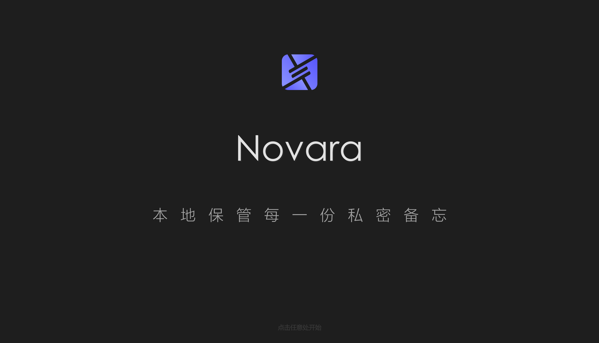

## 数据导入与导出

你的数据随你自由迁移，无供应商锁定：

- **加密备份**：导出受独立备份密码保护的 `.novaenc` 认证加密容器；库已加密时，明文导出会给出明确警告
- **原生备份**：明文 `.novabak` 导出，带 SHA-256 完整性头（旧 MD5 头文件仍可导入）；换机迁移时路径条目默认排除
- **CSV 导入/导出**：自动识别 Novara、KeePass、Bitwarden 以及 Firefox / Chrome / 1Password / Proton Pass 等方言，方便迁移凭证
- **PDF / HTML 合集**：把全部记录导出为可打印的 HTML 或 PDF 合集
- **Markdown 导出**：单篇 Markdown，可含 / 不含图片
- **滚动自动备份**：最多 10 份可恢复的本地快照

## 启动、托盘与系统集成

- **开机自启**：登录时工作区即就绪
- **系统托盘模式**：让 Novara 在后台安静常驻
- **快速捕获**：任意界面按 Ctrl+Shift+N 唤出小输入框，一键分派为备忘 / 待办 / 便签
- **全局右键菜单**：在资源管理器中右键任意文件/文件夹即可加入路径备份，或右键桌面直接打开 Novara
- **桌面提醒**：倒计时卡片在主程序关闭后依然工作

## 下一站

8.0 补齐了双向同步，路线图将从同一地基上生长——三红线恒定：**服务器零明文、无官方云、离线能力永不倒退**。

- **现在 —— 跨设备同步（8.0）**：通过你自托管的服务器做端到端加密同步，含网页阅读器与受限编辑器、冲突处理
- **下一站 —— 一条命令部署**：Docker 镜像与 compose 文件，附 NAS 与 VPS 的完整教程
- **更远 —— 移动端原生 App**：把同一层数据控制做成手机上的原生客户端

## 数据与隐私一览

- **本地优先**：一切只存在你的电脑上——无云、无遥测、无账号
- **认证加密**：AES-256-GCM + PBKDF2 密钥派生（格式 v3 起为 3,000,000 次迭代）
- **服务器只见密文**：互联时代，任何离开你电脑的东西都先经过加密——服务器只做密文的保管或中转
- **同步由你托管**：跨设备同步跑在你自己的服务器上，服务端不持有密钥，且随时能从电脑重建
- **便携单文件**：`data.novadb` 承载全部七个分区；可选密码保护整个数据库
- **健康检查**：加密状态、最近备份、快照份数、文件完整性与孤儿引用一览无余
- **可恢复删除**：回收站给你一周时间，任何内容才真正消失
- **Agent 就绪而不泄密**：MCP 接口自身绝不把你的数据发往任何地方

## 隐私与安全

- **隐私政策** — [English](PRIVACY.md) · [简体中文](PRIVACY.zh-CN.md)
- **安全说明** — [English](SECURITY.md) · [简体中文](SECURITY.zh-CN.md)

## 许可证

Novara 依据 [MIT 许可证](LICENSE.md) 开源发布。

---

Novara 免费使用，并将保持免费。最新版本与官方使用教程请访问 **novara.xin**。
