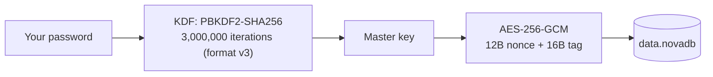
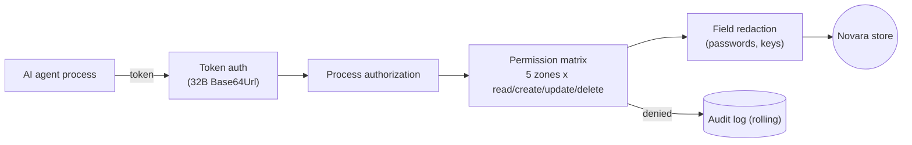
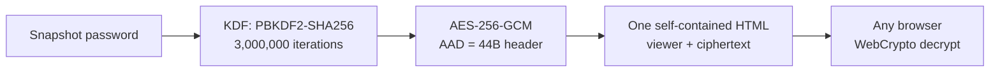

# Security Architecture

Novara is a local-first personal data control layer — for you, and for your AI agents. Three independent trust chains protect it: your data at rest, your AI agent's access, and — since 7.0 — your data wherever you take it. This page gives a one-glance map of what protects what, and how to verify your download.

## 1. Data at rest — the privacy-lock chain



- The password itself never touches disk. `security.dat` keeps only an independently salted, versioned hash (PBKDF2-SHA256 3,000,000 iterations since its v2) used for lock-screen verification — it is not the encryption key and cannot decrypt the database.
- Databases in older formats migrate forward through one-time opt-in prompts: v1 (plaintext) → v2 (AES-CBC, 100,000 iterations) → v3 (AES-256-GCM, 3,000,000 iterations). Every migration keeps a backup-compatible path.
- Windows Hello never stores or derives the master key. It only gates retrieval of your password from the OS credential vault; the chain above remains the single source of decryption. Failure or absence of Windows Hello always falls back to the password.

## 2. Agent access — the MCP chain



- A locked or encrypted database blocks **all** MCP reads, regardless of token validity or granted permissions.
- The memo (credentials) zone is denied by default even for reads; deletion additionally requires the global delete switch, and both gates are enforced at the single write entry point.
- Every allowed and denied call lands in a rolling audit log with the originating process name attached.
- The MCP front-end (`NovaraMCP.exe`) is a stateless stdio-to-pipe forwarder: it holds no keys and no data.

## 3. Snapshot export — the connected chain (7.0+)



- **One container, everywhere.** The snapshot embeds the database as a `.novaenc` v4 ciphertext block — the identical versioned contract as encrypted backups (44-byte self-describing header as AES-GCM additional data, gzip-compressed payload). Desktop and browser decrypt the same bytes; the container never changes silently, only through a new version number.
- **Plaintext never ships.** A plaintext vault refuses to export; MCP tokens and client-authorization data are stripped from settings before the snapshot is sealed.
- **Zero network by construction.** The viewer file performs no network requests — decryption runs locally in the browser via WebCrypto. The snapshot password is never stored and cannot be recovered; refresh the page and the plaintext is gone from memory.
- **Read-only is the security boundary.** The viewer cannot edit, cannot upload, and cannot persist anything — including to your browser's storage.

## Trust boundaries

- All user data lives in `%LocalAppData%\Novara` — no cloud, no telemetry, no accounts. The only network activity is user-triggered API connectivity checks (memos) and MCP access on a local named pipe. The exported Snapshot viewer file performs no network requests at all.
- Plaintext `.novabak` exports carry integrity checksums (corruption detection, not tamper protection). `.novaenc` encrypted exports use AES-256-GCM with an independent password that is never stored and cannot be recovered — the same container protects Snapshot exports (7.0+).
- The desktop sticky-note host (`StickNoteHost.exe`) is a separate process and holds no decryption keys; it only renders what you explicitly send to the desktop.
- Known limits are documented honestly in [SECURITY.md](../SECURITY.md) — including that Windows Hello is a software gate, not a cryptographic binding.

## Verify your download

Every release ships a `SHA256SUMS` file next to the installer. Compare before installing:

```
sha256sum -c SHA256SUMS                    # Linux / Git Bash
Get-FileHash -Algorithm SHA256 Novara_Setup_*.exe   # PowerShell (compare manually)
```
