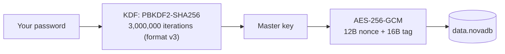
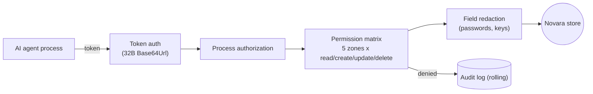
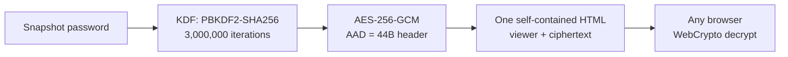
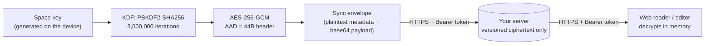

# Security Architecture

Novara is a local-first personal data control layer — for you, and for your AI agents. Four independent trust chains protect it: your data at rest, your AI agent's access, your data wherever you take it (7.0), and your data moving between your own devices (8.0). This page gives a one-glance map of what protects what, and how to verify your download.

## 1. Data at rest — the privacy-lock chain


```mermaid
flowchart LR
    P["Your password"] --> K["KDF: PBKDF2-SHA256<br/>3,000,000 iterations (format v3)"]
    K --> M[Master key]
    M --> A["AES-256-GCM<br/>12B nonce + 16B tag"]
    A --> D[("data.novadb")]
```

- The password itself never touches disk. `security.dat` keeps only an independently salted, versioned hash (PBKDF2-SHA256 3,000,000 iterations since its v2) used for lock-screen verification — it is not the encryption key and cannot decrypt the database.
- Databases in older formats migrate forward through one-time opt-in prompts: v1 (plaintext) → v2 (AES-CBC, 100,000 iterations) → v3 (AES-256-GCM, 3,000,000 iterations). Every migration keeps a backup-compatible path.
- Windows Hello never stores or derives the master key. It only gates retrieval of your password from the OS credential vault; the chain above remains the single source of decryption. Failure or absence of Windows Hello always falls back to the password.

## 2. Agent access — the MCP chain


```mermaid
flowchart LR
    A["AI agent process"] -- token --> T["Token auth<br/>(32B Base64Url)"]
    T --> W["Process authorization"]
    W --> P["Permission matrix<br/>5 zones x read/create/update/delete"]
    P --> R["Field redaction<br/>(passwords, keys)"]
    R --> O(("Novara store"))
    P -- denied --> L[("Audit log (rolling)")]
```

- A locked or encrypted database blocks **all** MCP reads, regardless of token validity or granted permissions.
- The memo (credentials) zone is denied by default even for reads; deletion additionally requires the global delete switch, and both gates are enforced at the single write entry point.
- Every allowed and denied call lands in a rolling audit log with the originating process name attached.
- The MCP front-end (`NovaraMCP.exe`) is a stateless stdio-to-pipe forwarder: it holds no keys and no data.

## 3. Snapshot export — the connected chain (7.0+)


```mermaid
flowchart LR
    P["Snapshot password"] --> K["KDF: PBKDF2-SHA256<br/>3,000,000 iterations"]
    K --> A["AES-256-GCM<br/>AAD = 44B header"]
    A --> H["One self-contained HTML<br/>viewer + ciphertext"]
    H --> B["Any browser<br/>WebCrypto decrypt"]
```

- **One container, everywhere.** The snapshot embeds the database as a `.novaenc` v4 ciphertext block — the identical versioned contract as encrypted backups (44-byte self-describing header as AES-GCM additional data, gzip-compressed payload). Desktop and browser decrypt the same bytes; the container never changes silently, only through a new version number.
- **Plaintext never ships.** Every export requires a password (your privacy-lock password or an independent one) and produces the same encrypted v4 container — a plaintext vault takes exactly the same path; MCP tokens and client-authorization data are stripped from settings before the snapshot is sealed.
- **Zero network by construction.** The viewer file performs no network requests — decryption runs locally in the browser via WebCrypto. The snapshot password is never stored and cannot be recovered; refresh the page and the plaintext is gone from memory.
- **Read-only is the security boundary.** The viewer cannot edit, cannot upload, and cannot persist anything — including to your browser's storage.

## 4. Cross-device sync — the two-way chain (8.0+)


```mermaid
flowchart LR
    P["Space key<br/>(generated on the device)"] --> K["KDF: PBKDF2-SHA256<br/>3,000,000 iterations"]
    K --> A["AES-256-GCM<br/>AAD = 44B header"]
    A --> E["Sync envelope<br/>(plaintext metadata + base64 payload)"]
    E -- "HTTPS + Bearer token" --> S[("Your server<br/>versioned ciphertext only")]
    S -- "HTTPS + Bearer token" --> W["Web reader / editor<br/>decrypts in memory"]
```

- **The server is a blind store.** It holds one ciphertext blob per version plus a small plaintext envelope: container / crypto / sync version numbers, the base version the payload was built on, a device id and a timestamp. It has no key, no user accounts, performs no decryption and writes no plaintext logs.
- **Key separation is the whole design.** The space key is generated on the first device and never leaves the paired devices. The server prints a space id and an enrollment secret exactly once; afterwards each device authenticates with its own token, stored server-side only as a SHA-256, compared in constant time, with failure rate limiting. Revoking a device therefore costs nothing — whatever it downloaded stays unreadable to it.
- **Same container, same contract.** Every payload is the `.novaenc` v4 container, re-sealed with a fresh random salt on each push. An upload declares the version it is based on; a mismatch becomes a conflict instead of a silent overwrite, and the superseded version stays on the server for rollback.
- **Plaintext is memory-only on the web side.** The browser reader/editor keeps decrypted data in JS memory: nothing is persisted, the clipboard is cleared after 30 seconds, and memory is cleared after 5 minutes idle.
- **Local audit.** Uploads, downloads, conflict detections and conflict resolutions are recorded locally, and the device center shows each paired device's trust state and last sync.

## Trust boundaries

- All user data lives in `%LocalAppData%\Novara` — no cloud, no telemetry, no accounts. The only network activity is user-triggered API connectivity checks (memos), MCP access on a local named pipe, and — if you switch it on — sync to the server you configured yourself (8.0+), plus the in-app update check you trigger against the release site (9.0+). The exported Snapshot viewer file performs no network requests at all.
- Plaintext `.novabak` exports carry integrity checksums (corruption detection, not tamper protection). `.novaenc` encrypted exports use AES-256-GCM with an independent password that is never stored and cannot be recovered — the same container protects Snapshot exports (7.0+).
- The desktop sticky-note host (`StickNoteHost.exe`) is a separate process and holds no decryption keys; it only renders what you explicitly send to the desktop.
- Known limits are documented honestly in [SECURITY.md](../SECURITY.md) — including that Windows Hello is a software gate, not a cryptographic binding.

## Verify your download

Every release ships a `SHA256SUMS` file next to the installer. Compare before installing:

```
sha256sum -c SHA256SUMS                    # Linux / Git Bash
Get-FileHash -Algorithm SHA256 Novara_Setup_*.exe   # PowerShell (compare manually)
```
