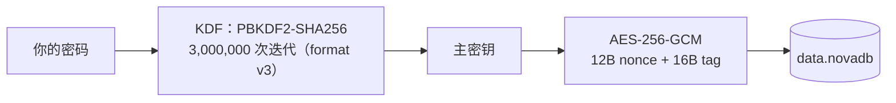
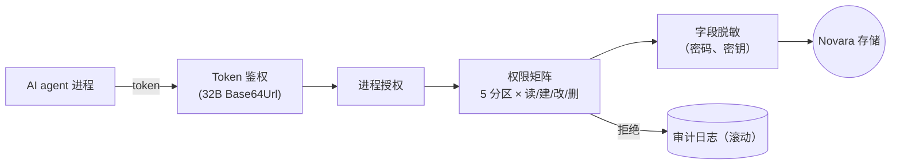
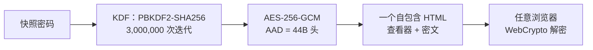

# 安全架构

Novara 是一个本地优先的个人数据控制层——为你，也为你的 AI。三条相互独立的信任链保护它：你的静态数据、你的 AI 的访问，以及——自 7.0 起——你带数据去的一切地方。本页一图看清「什么在保护什么」，以及如何校验你的下载。

## 一、静态数据——隐私锁链



- 密码本身不落盘。`security.dat` 只保存一份独立加盐、带版本号的哈希（其 v2 起为 PBKDF2-SHA256 3,000,000 次迭代），用于锁屏验证——它不是加密密钥，无法解密数据库。
- 旧格式数据库通过一次性自愿弹窗向前迁移：v1（明文）→ v2（AES-CBC，100,000 次迭代）→ v3（AES-256-GCM，3,000,000 次迭代）。每次迁移都保留备份兼容路径。
- Windows Hello 既不存储也不派生主密钥。它只负责「把密码从系统凭据保险箱取回」的手势门禁；上图链路始终是解密的唯一来源。Hello 失败或不可用时永远回退到密码输入。

## 二、Agent 访问——MCP 链



- 数据库处于锁定或加密状态时，**所有** MCP 读取一律被拒——与 token 是否有效、权限是否授予无关。
- 备忘（凭据）分区默认拒绝读取；删除额外受全局删除总开关约束，两道闸都在唯一写入入口强制执行。
- 每一次允许与拒绝的调用都会进入滚动审计日志，并附上发起进程名。
- MCP 前端（`NovaraMCP.exe`）是无状态的 stdio-管道转发器：不持有任何密钥与数据。

## 三、快照导出——互联链（7.0+）



- **一容器，处处同。** 快照把数据库以 `.novaenc` v4 密文块内嵌——与加密备份完全同一份版本化契约（44 字节自描述头作为 AES-GCM 附加数据、gzip 压缩载荷）。桌面端与浏览器解密的是同一串字节；容器绝不会被悄悄改写，只能走新版本号。
- **明文绝不出厂。** 明文库拒绝导出；封口前，MCP 令牌与客户端授权数据从设置中剥离。
- **构造上零联网。** 查看器文件不发起任何网络请求——解密在浏览器里经 WebCrypto 本地完成。快照密码从不存储、无法找回；刷新页面，明文即从内存消失。
- **只读就是安全边界。** 查看器不能编辑、不能上传、不能持久化任何东西——包括你的浏览器存储。

## 信任边界

- 全部用户数据位于 `%LocalAppData%\Novara`——无云端、无遥测、无账户。仅有的网络活动是用户主动触发的 API 连通性检测（备忘）与本地命名管道上的 MCP 访问。导出的 Snapshot 查看器文件不发起任何网络请求。
- 明文 `.novabak` 导出带完整性校验（可发现损坏，非防篡改）。`.novaenc` 加密导出使用 AES-256-GCM 与一个从不保存、无法找回的独立密码——同一容器也保护快照导出（7.0+）。
- 桌面便签宿主（`StickNoteHost.exe`）是独立进程，不持有解密密钥；它只渲染你显式发送到桌面的内容。
- 已知边界在 [SECURITY.md](../SECURITY.md) 中如实披露——包括 Windows Hello 是软件门禁而非密码学绑定。

## 校验你的下载

每个 Release 都在安装包旁提供 `SHA256SUMS`。安装前请先比对：

```
sha256sum -c SHA256SUMS                    # Linux / Git Bash
Get-FileHash -Algorithm SHA256 Novara_Setup_*.exe   # PowerShell（手动比对）
```
